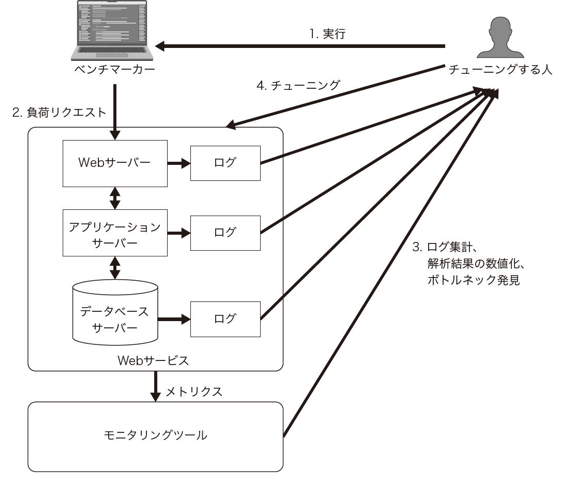
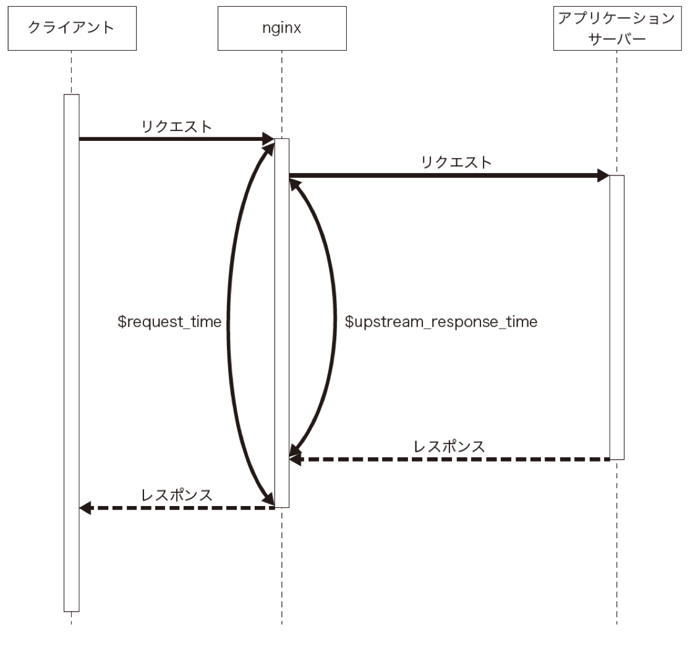

# ISUCON本ゆる読書会 #2
## Chapter 3 基礎的な負荷試験

Eitaro
2022年8月20日

---
# 今日の資料
[https://github.com/aoshimash/techresi-isucon-workshop/tree/main/ch3/slide](https://github.com/aoshimash/techresi-isucon-workshop/tree/main/ch3/slide)

---
# 負荷試験・ベンチマーカーとは
- 負荷試験
Webサービスに対して機械的に多数のリクエストを送信して負荷を与え、レスポンスを得るためにかかった時間などの結果を確認する試験。


---
# private-isuの場合
[https://github.com/catatsuy/privateisu](https://github.com/catatsuy/privateisu)
動作環境
- Ubuntu Linux
- RDBMSはMySQL
- ストレージはmemcached
- Webサーバ・リバースプロキシはnginx
---
# private-isuの場合
起動方法
1. AWS EC2
2. Docker
3. Vagrant
---
# 実行の様子
MySQLの初期データは初回起動時にGitHub Releaseから取得される
```
$cdwebapp/sql
$curl https://github.com/catatsuy/privateisu/releases/download/img/dump.sql.bz2
$bunzip2dump.sql.bz2$cd..
$dockercomposeup
(略)
webappmysql1 | [Entrypoint]running/dockerentrypointinitdb.d/dump.sql#<初期データ取り込み
(略)
webappmysql1|20220110T02:31:14.579477Z0[System][MY010931][Server]/usr/sbin/mysqld:readyforconnections.Version:'8.0.27'socket:'/var/lib/mysql/mysql.sock'port:3306MySQLCommunityServerGPL.
```
---
# nginxのアクセスログの集計
JSON形式に変更が必要
```
log_formatjsonescape=json'{"time":"$time_iso8601",''"host":"$remote_addr",''"port":$remote_port,''"method":"$request_method",''"uri":"$request_uri",''"status":"$status",''"body_bytes":$body_bytes_sent,''"referer":"$http_referer",''"ua":"$http_user_agent",''"request_time":"$request_time",''"response_time":"$upstream_response_time"}';access_log/var/log/nginx/access.logjson;
```
EC2の場合
`/etc/nginx/nginx.conf`
Dockerの場合
`webapp/etc/nginx/conf.d/default.conf`
に上記の変更を加えてnginxの再起動（restart or reload）

---
# nginxのアクセスログの集計
利用できる変数
| 変数名 | 意味 |
| ---- | ---- | 
| time_iso8601 | リクエストの終了時刻（ISO 8601形式） | 
| remote_port | リクエスト送信元のポート番号 | 
| request_method | リクエストのHTTPメソッド |
| request_uri | リクエストのURI | 
| request_time | リクエスト処理に要した秒 | 
| upstream_response_time | リバースプロキシとして動作する場合にプロキシ先からのレスポンスを得るまでの秒 | 

## シーケンス図
`request_time`と`Upstream_response_time`


---
# alpを使ったログ解析
```
cat access.log | alp json
```
[alp](https://github.com/tkuchiki/alp)
- ステータスコードごとのレスポンス回数
- レスポンスタイムの最小、最大、平均、合計、パーセンタイル値
- 返却したレスポンスサイズ（byte）の最小、最大、平均、合計
ISUCONの様な短期間でのログ解析用で実運用には適さない
長期では[fluentd](https://www.fluentd.org/)など
---
# [abコマンド（Apache Bench）](https://httpd.apache.org/docs/2.4/programs/ab.html)
HTTPベンチマーカー
Apache HTTP Serverに付属
例
```
ab - c 1 -n 10 http://localhost/
```
並列1で試行回数10回

---
# ログのローテーション方法
単に別名に変更するだけだと古いファイルの末尾に追記され続けるので、
以下いずれかの処理が必要。
1. nginxを再起動もしくはリロードする
2. nginxのmasterプロセスにシグナルを送信する

---
# パフォーマンスチューニングの流れ
1. ベンチマーカーでWebサービスに負荷をかける
2. ベンチマーカーによる計測結果を把握する
3. 負荷試験実行中にWebサービスを実行している環境の負荷を観察する
4. CPUなどのリソースを多く使用している要素を把握する
5. Webアプリケーションのコードやミドルウェアの設定を修正する
6. 1に戻る

---
# [MySQLのボトルネックを発見する（スロークエリログの解析）](https://dev.mysql.com/doc/refman/8.0/en/slow-query-log.html)
ISUCONではlong_query_timeを0にして、全てのクエリを記録する
こちらも```systemctl restart mysql```による再起動が必要
データベース処理で効率が悪いクエリを確認できる。
- インデックス不備
- N+1
など
---
# 複数のCPUを有効に利用するための設定
dstatコマンドでCPU使用率を観察
Ruby[unicorn](https://rubygems.org/gems/unicorn)
Python[gunicorn](https://gunicorn.org/)
worker数によって並列度を確認

---
# まとめ
性能改善したいWebサービスに対して以下のサイクルを学んだ
- Webアプリケーションで性能を計測するログの出力と集計方法
- ベンチマーカーによって負荷を与える方法
- 負荷試験中のサーバーリソースモニタリング
- ログの解析によるボトルネックの発見
- データベースへのインデックス付与による性能改善

---
# Reference

#### [達人が教えるWebパフォーマンスチューニング　〜ISUCONから学ぶ高速化の実践](https://amzn.to/3A3cZI8)
---
#

---
#

---
