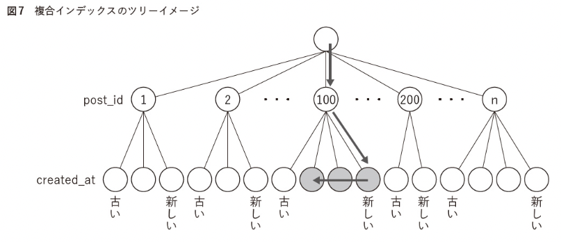
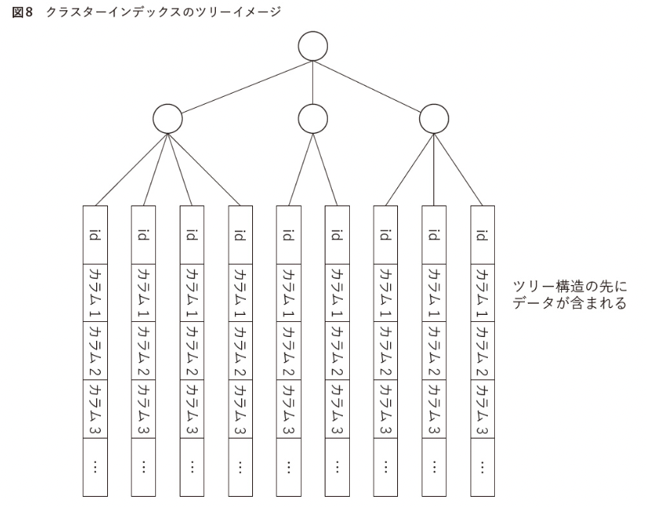
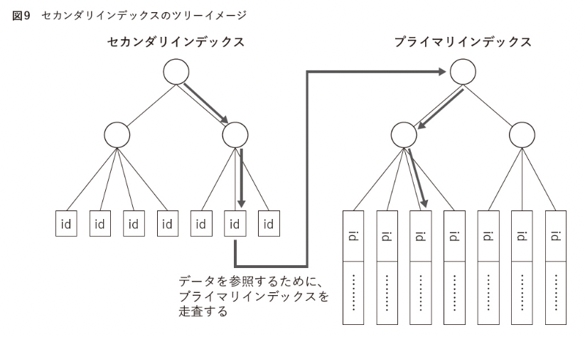

# ISUCON本ゆる輪読会#5 [Chapter5 データベースのチューニング]

これは[ISUCON本ゆる輪読会#5](https://connpass.com/event/260243/)用の資料です。

[ISUCON本ゆる輪読会#4](https://tech-residence.connpass.com/event/258772/)のつづきになるので、ハンズオンに参加する場合は[前回の資料](https://github.com/aoshimash/techresi-isucon-workshop/blob/main/ch5/slides/slides.pdf)の通りmultipassのハンズオン環境を作成しておいてください。

## 演習環境の用意

次のコマンドで前回のVMを立ち上げ直す、

```
multipass start private-isu
```

### 操作の復習

- VMのIP確認

```
multipass list
```

- VMへのログイン

```
multipass shell private-isu
```

- ベンチマーク実行

VM内の`/home/isucon/private_isu.git/benchmarker/`で以下を実行

```
./bin/benchmarker -u ./userdata -t http://localhost
```

- MySQLへの接続

VM内で次のコマンド

```
sudo mysql -uroot -proot
```

## 前回のおさらい

pt-query-digestで遅いクエリを見つけ出し、インデックスをはることでスコアを改善することができた


## 今日やること

- インデックスの理解と活用
- N+1問題の発見と解消

## インデックスの理解と活用

### インデックスで検索が高速になる理由（ゆるふわ）

インデックスは辞典における「索引」みたいなもの。索引がない辞典を想像すると、目当ての項目を見つけるのにものすごく時間がかかりそう。でも、特定のルールに沿って並んでいる索引（あいうえお順など）があると、検索速度が飛躍的に上がる。そういうかんじのやつ。

なにも手がかりがない状態で探索するとなると線形探索（$\mathcal{O}(n)$）になっちゃうけど、データ群が特定のルールに沿って並んでいる（インデックスがはってある）なら、二分探索（ $\mathcal{O}(\log n)$）でいけるからそれだけですごく速くなりそうだと想像できる。

（実際にデータベースのインデックスも二分探索に適したBツリーがよく利用されているらしい。）

### インデックスがはられているか確認

前回は`comments`テーブルの`post_id`にインデックスを貼って検索が高速になるところまで確認したが、そういえばインデックスがちゃんとはられているのか確認していなかったので、まずはそれを確認。

MySQLにログインして、データベースを選択してから、

```sql
USE isuconp;
```

次のコマンドでテーブルの構造を確認することができる。

```sql
DESC comments;
```
結果
```
+------------+-----------+------+-----+-------------------+-------------------+
| Field      | Type      | Null | Key | Default           | Extra             |
+------------+-----------+------+-----+-------------------+-------------------+
| id         | int       | NO   | PRI | NULL              | auto_increment    |
| post_id    | int       | NO   | MUL | NULL              |                   |
| user_id    | int       | NO   |     | NULL              |                   |
| comment    | text      | NO   |     | NULL              |                   |
| created_at | timestamp | NO   |     | CURRENT_TIMESTAMP | DEFAULT_GENERATED |
+------------+-----------+------+-----+-------------------+-------------------+
```

indexが設定されているかどうかは `Key` 列でわかる。`PRI`がPrimary Key で `MUL`がMultiple Key（重複可能なキー）。


ちなみに、インデックスを確認したいだけなら次のコマンドでもOK。

```sql
SHOW INDEX FROM comments;
```
結果
```
+----------+------------+-------------+--------------+-------------+-----------+-------------+----------+--------+------+------------+---------+---------------+---------+------------+
| Table    | Non_unique | Key_name    | Seq_in_index | Column_name | Collation | Cardinality | Sub_part | Packed | Null | Index_type | Comment | Index_comment | Visible | Expression |
+----------+------------+-------------+--------------+-------------+-----------+-------------+----------+--------+------+------------+---------+---------------+---------+------------+
| comments |          0 | PRIMARY     |            1 | id          | A         |       99505 |     NULL |   NULL |      | BTREE      |         |               | YES     | NULL       |
| comments |          1 | post_id_idx |            1 | post_id     | A         |       10075 |     NULL |   NULL |      | BTREE      |         |               | YES     | NULL       |
+----------+------------+-------------+--------------+-------------+-----------+-------------+----------+--------+------+------------+---------+---------------+---------+------------+
2 rows in set (0.01 sec)
```


### クエリの実行計画を確認

どのインデックスを使うのかとかは、オプティマイザというDBの機能がSQLクエリを解析してなんかいい感じにやってくれてる。（オプティマイザが何をしているのかより詳細に知りたい場合はこちら。 https://dev.mysql.com/doc/internals/en/optimizer-tracing.html）

`EXPLAIN`ステートメントでクエリの実行計画を確認して、意図したとおりにインデックスが使われているか確認することができる。

``` sql
EXPLAIN SELECT * FROM `comments` WHERE `post_id` = 100 ORDER BY `created_at` DESC LIMIT 3\G
```
結果
```
*************************** 1. row ***************************
           id: 1
  select_type: SIMPLE
        table: comments
   partitions: NULL
         type: ref
possible_keys: post_id_idx
          key: post_id_idx
      key_len: 4
          ref: const
         rows: 5
     filtered: 100.00
        Extra: Using filesort
1 row in set, 1 warning (0.00 sec)
```

`possible_keys`が選択可能なインデックス、`key`が実際に選択されたインデックス、`rows`が調査される行の見積もり。

なので、ちゃんと`pont_id_idx`がインデックスとして使われていて、調査する行も5行と小さい値になっていることがわかる。（インデックス貼る前と比較すればよかった...）


### 複合インデックス

さっきのクエリをもう一度確認すると、`Extra`の項目に`Using filesort`と書かれていることがわかる。これは、MySQL内部でsort処理が行われていることを示している。sort処理はデータベースにとって負担が大きい処理の一つなのでこれを解決する。（今回はsortする行が5行と少ないのでそこまで負担ではないはずだけどまあ練習で）

次のクエリでもともと貼ってあった`post_id`だけのインデックスを外して、 `post_id`と`created_at`の２つのカラムからなる複合インデックスを作る。

```sql
ALTER TABLE `comments` DROP INDEX `post_id_idx`, ADD INDEX `post_id_idx` (`post_id`, `created_at`);
```


(「達人が教えるWebパフォーマンスチューニング」より)

`EXPLAIN`ステートメントの結果がどのように変わったのか確認する。

```sql
EXPLAIN SELECT * FROM `comments` WHERE `post_id` = 100 ORDER BY `created_at` DESC LIMIT 3\G
```
結果
```
*************************** 1. row ***************************
           id: 1
  select_type: SIMPLE
        table: comments
   partitions: NULL
         type: ref
possible_keys: post_id_idx
          key: post_id_idx
      key_len: 4
          ref: const
         rows: 5
     filtered: 100.00
        Extra: Backward index scan
1 row in set, 1 warning (0.00 sec)
```

`Extra`の`Using filesort`が`Backward index scan`に変わった。
上図のように昇順に並んでいるインデックスを逆向きに読んだことを表している。逆向きに読んでしまっているので、これを降順インデックスに変えればさらに処理が少なくなる可能性がある。

```sql
ALTER TABLE `comments` DROP INDEX post_id_idx, ADD INDEX post_id_idx(`post_id`,`created_at`DESC);
```

再び`EXPLAIN`を実行

```sql
EXPLAIN SELECT * FROM `comments` WHERE `post_id` = 100 ORDER BY `created_at` DESC LIMIT 3\G
```

結果

```
*************************** 1. row ***************************
           id: 1
  select_type: SIMPLE
        table: comments
   partitions: NULL
         type: ref
possible_keys: post_id_idx
          key: post_id_idx
      key_len: 4
          ref: const
         rows: 5
     filtered: 100.00
        Extra: NULL
1 row in set, 1 warning (0.01 sec)
```

`Backward index scan`が`NULL`になった。

### クラスターインデックスでのインデックスチューニング

#### インデックスの種類

MySQLをはじめとする多くのデータベースには、プライマリインデックスとセカンダリインデックスと呼ばれる２種類のインデックスがある。

- プライマリインデックス:
  - カラムに格納される値がすべてユニーク
  - int型でシーケンシャルな数字を自動付与することが多いが、UUIDなどをつけることもある
  - 2つのカラムデータの組み合わせがユニークであれば複合インデックスをプライマリインデックスにすることもできる
- セカンダリインデックス:
  - プライマリインデックス以外のインデックスは全てセカンダリインデックス

#### クラスターインデックスとは

MySQL（InnoDBストレージエンジン）のプライマリーキーはクラスターインデックスになっている。

クラスターインデックスとは、プライマリーインデックスのツリー構造の先に、データが含まれている構造のこと。


(「達人が教えるWebパフォーマンスチューニング」より)

プライマリーインデックスツリーの葉にはデータがある。


(「達人が教えるWebパフォーマンスチューニング」より)

セカンダリインデックスツリーの葉はプライマリーキーの値。中のデータを参照するためには、プライマリインデックスツリーを走査する必要がある。

#### セカンダリインデックスの特徴を生かした検索の効率化

たとえば、「あるユーザーのコメント数を数えたい」という場合を考える。

クエリは次のようになる。

```sql
SELECT COUNT(*) FROM comments WHERE user_id = 123;
```

どのように実行されるのか確認しておく、

```sql
EXPLAIN SELECT COUNT(*) FROM comments WHERE user_id = 123\G
```
結果
```
*************************** 1. row ***************************
           id: 1
  select_type: SIMPLE
        table: comments
   partitions: NULL
         type: ALL
possible_keys: NULL
          key: NULL
      key_len: NULL
          ref: NULL
         rows: 99505
     filtered: 10.00
        Extra: Using where
1 row in set, 1 warning (0.01 sec)
```

このクエリを高速に行うためには、まず`user_id`にインデックスが必要なので作成する。

```sql
ALTER TABLE `comments` ADD INDEX `idx_user_id`(`user_id`);
```

今回のやりたいことは「`comments`テーブルから特定のユーザーがしたコメントの数を数える」ことなので、`user_id`のセカンダリインデックスツリーの調査だけで「コメントの数」はわかってしまう。つまりプライマリインデックスツリーまで走査する必要がないのでその分効率的。

このようにセカンダリインデックスに含まれる情報だけで結果が返せる最適化をCoverning Indexという。

Coverning Indexでクエリを解決できているかどうかは`EXPLAIN`で確認できる。

```sql
EXPLAIN SELECT COUNT(*) FROM comments WHERE user_id = 123\G
```

結果

```
*************************** 1. row ***************************
           id: 1
  select_type: SIMPLE
        table: comments
   partitions: NULL
         type: ref
possible_keys: idx_user_id
          key: idx_user_id
      key_len: 4
          ref: const
         rows: 100
     filtered: 100.00
        Extra: Using index
1 row in set, 1 warning (0.01 sec)
```

`Extra`に`Using index`がついていることから、Coverning Indexでクエリを解決できていることがわかる。

### アンチパターン

- インデックスが増えるとデータ更新時の負荷が高くなるので、インデックスの作りすぎもよくない。
- クエリ実行時に1つのテーブルに対して同時に使われるインデックスの個数は1個なので、複数のインデックスがあっても、データの絞り込みが速くなるわけではない。
- 様々な条件で検索する機能がある場合は、頻繁に使われるものだけインデックスを用意し、それ以外は「ORDER BY狙いのインデックス」を作成していくと良いらしい。

### その他のインデックス

MySQLがサポートするその他のインデックス

- 全文検索インデックス
  - データベース中に格納されるテキストデータから、特定の文字列を含む行の検索（`LIKE`クエリ）は全件走査してしまうので遅い。
  - MySQLでは全文検索インデックスを簡単に付与することができるが、検索や更新の負荷が高いので注意が必要。
  - MySQLでやらずにElasticsearchなどの専門の全文検索エンジンの利用も考慮するべき。
- 空間インデックス
  - 地図上の複数の座標を結んだ多角形の内側にある座標の検索などが簡単に、かつ高速に行うことができるようになる。

## N+1問題の発見と解消

### 事前準備

private-isuのappをruby実装からgo実装に変更する。（最初にやっておけばよかった...）

#### go実装への切り替え

```command
sudo systemctl stop isu-ruby
sudo systemctl disable isu-ruby
sudo systemctl start isu-go
sudo systemctl enable isu-go
```

動作確認

```command
systemctl status isu-go
```

activeになっていれば問題ない。

あとは、ブラウザからもアクセスできるか確認。

#### ファイルディスクリプタの上限変更

go実装に変更してベンチを回したら`too many open files`が出てしまったので、ファイルディスクリプタの上限を上げておく。

一応今の設定値確認

```
ulimit -n
```

1024だったので思い切って65536くらいまで上げてしまう。

`/etc/security/limits.conf`の末尾にこれを追加

```
* soft nofile 65536
* hard nofile 65536
```

VM再起動

```
sudo reboot
```

#### ベンチマーク再計測

appをgoに切り替えたので再び計測しておく。
もういちどVMにログインしてログのローテート

```command
sudo mv /var/log/mysql/mysql−slow.log /var/log/mysql/mysql−slow.log.bak3
sudo systemctl restart mysql
```

ベンチマーク実行

```command
cd /home/isucon/private_isu.git/benchmarker
./bin/benchmarker -u ./userdata -t http://localhost
```

slow-queryログをpt-query-digestにかける

```command
sudo pt-query-digest /var/log/mysql/mysql−slow.log > ~/pt-query-digest.log4
less ~/pt-query-digest.log4
```

### N+1問題の例

`~/pt-query-digest.log4`に次のようなログがある。

```
# Query 5: 1.76k QPS, 0.12x concurrency, ID 0x396201721CD58410E070DA9421CA8C8D at byte 69723609
# This item is included in the report because it matches --limit.
# Scores: V/M = 0.00
# Time range: 2022-09-18T07:51:10 to 2022-09-18T07:52:13
# Attribute    pct   total     min     max     avg     95%  stddev  median
# ============ === ======= ======= ======= ======= ======= ======= =======
# Count         15  110984
# Exec time      8      7s    15us    19ms    67us   144us   297us    26us
# Lock time     42   116ms       0     4ms     1us     1us    21us     1us
# Rows sent      0 108.38k       1       1       1       1       0       1
# Rows examine   0 108.38k       1       1       1       1       0       1
# Query size     3   4.01M      36      39   37.90   36.69    0.17   36.69
# String:
# Databases    isuconp
# Hosts        localhost
# Users        isuconp
# Query_time distribution
#   1us
#  10us  ################################################################
# 100us  ####
#   1ms  #
#  10ms  #
# 100ms
#    1s
#  10s+
# Tables
#    SHOW TABLE STATUS FROM `isuconp` LIKE 'users'\G
#    SHOW CREATE TABLE `isuconp`.`users`\G
# EXPLAIN /*!50100 PARTITIONS*/
SELECT * FROM `users` WHERE `id` = 932\G
```

`Exec time`をみると、95%のクエリが144マイクロ秒以下なので1クエリごとでみると高速だが、110984回も呼び出されているため5番目に負荷の大きいクエリになっている。

このクエリは [makePosts関数](https://github.com/catatsuy/private-isu/blob/096802b1d54481105624d7010c531e3b6328b170/webapp/golang/app.go#L174)で呼び出されているので、この関数の中身を詳しくみていく。

ちなみに、この関数を読むのに重要な `Post` と `Comment` の型はこんなかんじ。

```golang
type Post struct {
	ID           int       `db:"id"`
	UserID       int       `db:"user_id"`
	Imgdata      []byte    `db:"imgdata"`
	Body         string    `db:"body"`
	Mime         string    `db:"mime"`
	CreatedAt    time.Time `db:"created_at"`
	CommentCount int
	Comments     []Comment
	User         User
	CSRFToken    string
}
```

``` golang
type Comment struct {
	ID        int       `db:"id"`
	PostID    int       `db:"post_id"`
	UserID    int       `db:"user_id"`
	Comment   string    `db:"comment"`
	CreatedAt time.Time `db:"created_at"`
	User      User
}
```

`makePosts`関数にコメント追加してみた。


```golang
// Post構造体のスライスを受け取り、不足しているフィールド情報を付け足す関数
// args:
//  - results: (フィールド情報が不足している)Postのスライス
//  - csrfToken: CSRFトークン
//  - allComments: コメントを全件取得するかしないかのboolean (falseの場合は最新3コメントのみ取得)
// return:
//  - posts: (フィールド情報が追加された)Postのスライス
func makePosts(results []Post, csrfToken string, allComments bool) ([]Post, error) {
	var posts []Post

	for _, p := range results {
    // Postの全コメント数(CommentCount)を取得
		err := db.Get(&p.CommentCount, "SELECT COUNT(*) AS `count` FROM `comments` WHERE `post_id` = ?", p.ID)
		if err != nil {
			return nil, err
		}

    // Postのコメント(Comment)から最新3つを取得　ただし、allCommentsがtrueの場合は全コメントを取得
		query := "SELECT * FROM `comments` WHERE `post_id` = ? ORDER BY `created_at` DESC"
		if !allComments {
			query += " LIMIT 3"
		}
		var comments []Comment
		err = db.Select(&comments, query, p.ID)
		if err != nil {
			return nil, err
		}

    // さらに、上で取得したCommentの不足しているフィールド(User)情報を取得
    /*
    *  ここがN+1
    */
		for i := 0; i < len(comments); i++ {
			err := db.Get(&comments[i].User, "SELECT * FROM `users` WHERE `id` = ?", comments[i].UserID)
			if err != nil {
				return nil, err
			}
		}

		// Commentスライスの並び順を逆にする(新しい順から古い順に)
		for i, j := 0, len(comments)-1; i < j; i, j = i+1, j-1 {
			comments[i], comments[j] = comments[j], comments[i]
		}

		p.Comments = comments

    // Postの `User` フィールドの値を取得
		err = db.Get(&p.User, "SELECT * FROM `users` WHERE `id` = ?", p.UserID)
		if err != nil {
			return nil, err
		}

    // PostのCSRFTokenフィールドをセット
		p.CSRFToken = csrfToken

    // PostのUserフィールドのDelFlgフィールドが0の場合はpostに追加
    // (削除フラグが立っているUserのPostは表示しない)
		if p.User.DelFlg == 0 {
			posts = append(posts, p)
		}

    // 1ページあたりに表示するPost数以上は処理を続けない
		if len(posts) >= postsPerPage {
			break
		}
	}

	return posts, nil
}
```

つまり、コメント一覧（N件）を下記のクエリで取得したのち、

```sql
SELECT * FROM `comments` WHERE `post_id` = ? ORDER BY `created_at` DESC
```

そのN件に対してさらにループを回して、次のクエリを発行してしまっている。

```sql
SELECT * FROM `users` WHERE `id` = ?
```

このように、1回のクエリで得た結果の件数(N個)に対して、関連する情報を集めるため、N回以上のクエリを実行してしまうことでアプリケーションのレスポンス速度の低下やデータベースの負荷の原因になることをN+1問題という。


### N+1問題の見つけ方

今回はpt-query-digestの結果を見て実行数が多いクエリから探したが、APMやプロファイラ、フレームワークの機能でN+1に警告を出してくれたりするらしい。（ぜひこの辺をちゃんと使えるようにしたい）

また、N+1を発見してもそれがボトルネックになっているのかは、確認が必要である。あまり呼ばれていない関数や速度が求められていない場所の高速化に時間をかけないように注意。（ちなみに、`~/pt-query-digest.log4`の結果を見てもらってもわかるとおり、`makePosts`関数は現状ボトルネックにはなっていない。N+1問題の例として都合が良かったので今回説明に使ってるだけ。）

### N+1問題の解消方法いろいろ

- キャッシュを使う
  - memcashedやRedisなどにデータベース情報をキャッシュとして保存する
  - キャッシュサーバーを参照するだけではN+1自体は解決されないが、データベースの負荷を減らすことができる
  - 大規模なWebサービスで活用される
  - Chapter7で詳しくやるので今回は具体的な説明は省略
- プリロードを使う
  - ループで回して毎回クエリ発行していた内容を`IN`句でまとめて1回のクエリにして発行する。
- JOINを使う
  - 2つ以上のテーブルをJOINを利用して一度のSQLで参照する。

### プリロードを用いたN+1の解決

N回ループさせてしまっていたコマンドをIN句でまとめて1個のクエリにすればDBへのアクセス数が減って高速化できるという話。

具体的なクエリで書くと、

```sql
SELECT * FROM `users` WHERE `id` = 1
SELECT * FROM `users` WHERE `id` = 2
SELECT * FROM `users` WHERE `id` = 3
```

みたいになっていたクエリを`IN`句を使って次のようにまとめたい。

```sql
SELECT * FROM `users` WHERE `id` IN (1,2,3)
```

N+1になっていたこの部分を、

```golang
for i := 0; i < len(comments); i++ {
	err := db.Get(&comments[i].User, "SELECT * FROM `users` WHERE `id` = ?", comments[i].UserID)
	if err != nil {
		return nil, err
	}
}
```

次のようにクエリをまとめる関数として切り出す。

```golang
func preloadUsers(ids []int) (map[int]User, error) {
	// 結果を入れるmapを用意
	users := map[int]User{}

	if len(ids) == 0 {
		return users, nil
	}

	query, params, err := sqlx.In(
		"SELECT * FROM `users` WHERE `id` IN (?)",
		ids,
	)
	if err != nil {
		return nil, err
	}

	// クエリを発行してユーザー情報を取得
	us := []User{}
	err = db.Select(&us, query, params...)
	if err != nil {
		return nil, err
	}

	for _, u := range us {
		users[u.ID] = u
	}

	return users, nil
}
```

書き換えた`app.go`の全文はこちら。
https://github.com/aoshimash/techresi-isucon-workshop/blob/main/ch5/enshu/sample/preload/app.go

これを実行するために、まずはgolangをインストールする。

```command
sudo add-apt-repository ppa:longsleep/golang-backports
sudo apt update
sudo apt install golang-go
```

次に`isucon`ユーザーになってアプリを再ビルドする。

```command
sudo su isucon
cd /home/isucon/private_isu/webapp/golang
mv app.go app.go.original
curl -O https://raw.githubusercontent.com/aoshimash/techresi-isucon-workshop/main/ch5/enshu/sample/preload/app.go
./setup.sh
exit
```

`isu-go`を再起動

```
sudo systemctl restart isu-go
```

ログローテートしてベンチマークまでをワンライナーで

```
sudo mv /var/log/mysql/mysql−slow.log /var/log/mysql/mysql−slow.log.bak4 && sudo systemctl restart mysql && sleep 20 && /home/isucon/private_isu.git/benchmarker/bin/benchmarker -u /home/isucon/private_isu.git/benchmarker/userdata -t http://localhost && sudo pt-query-digest /var/log/mysql/mysql−slow.log > ~/pt-query-digest.log5
```

pt-query-digestの結果を確認

```
less ~/pt-query-digest.log5
```

Countが減ったはず。

```

# Query 7: 781.67 QPS, 0.06x concurrency, ID 0x396201721CD58410E070DA9421CA8C8D at byte 138830748
# This item is included in the report because it matches --limit.
# Scores: V/M = 0.00
# Time range: 2022-09-22T16:40:46 to 2022-09-22T16:41:49
# Attribute    pct   total     min     max     avg     95%  stddev  median
# ============ === ======= ======= ======= ======= ======= ======= =======
# Count          8   49245
# Exec time      4      4s    16us    18ms    81us   176us   357us    28us
# Lock time     22    56ms       0     3ms     1us     1us    20us     1us
# Rows sent      0  48.09k       1       1       1       1       0       1
# Rows examine   0  48.09k       1       1       1       1       0       1
# Query size     1   1.78M      36      39   37.89   36.69    0.15   36.69
# String:
# Databases    isuconp
# Hosts        localhost
# Users        isuconp
# Query_time distribution
#   1us
#  10us  ################################################################
# 100us  #####
#   1ms  #
#  10ms  #
# 100ms
#    1s
#  10s+
# Tables
#    SHOW TABLE STATUS FROM `isuconp` LIKE 'users'\G
#    SHOW CREATE TABLE `isuconp`.`users`\G
# EXPLAIN /*!50100 PARTITIONS*/
SELECT * FROM `users` WHERE `id` = 174\G
```

ちなみに、IN句に値を渡しすぎることには注意が必要。多すぎると、
- クエリのサイズが大きくなりすぎてエラーになる
  - `max_allowed_packet`で設定されている。（MySQL8.0のデフォルトは64MB）
- 狙ったインデックスが使われなくなる
  - インデックスではなく、フルスキャンした方が早いと判断されることがある
  - `eq_range_index_dive_limit`で設定されている。(MySQL8.0のデフォルトは200)


### JOINを使ったN+1の解消

JOIN（INNER　JOIN）を使い、`comments`テーブルと`users`テーブルを結合して一つのテーブルにまとめてデータを抽出する。

`comments`テーブル

```
+------------+-----------+------+-----+-------------------+-------------------+
| Field      | Type      | Null | Key | Default           | Extra             |
+------------+-----------+------+-----+-------------------+-------------------+
| id         | int       | NO   | PRI | NULL              | auto_increment    |
| post_id    | int       | NO   | MUL | NULL              |                   |
| user_id    | int       | NO   | MUL | NULL              |                   |
| comment    | text      | NO   |     | NULL              |                   |
| created_at | timestamp | NO   |     | CURRENT_TIMESTAMP | DEFAULT_GENERATED |
+------------+-----------+------+-----+-------------------+-------------------+
```

`users`テーブル

```
+--------------+--------------+------+-----+-------------------+-------------------+
| Field        | Type         | Null | Key | Default           | Extra             |
+--------------+--------------+------+-----+-------------------+-------------------+
| id           | int          | NO   | PRI | NULL              | auto_increment    |
| account_name | varchar(64)  | NO   | UNI | NULL              |                   |
| passhash     | varchar(128) | NO   |     | NULL              |                   |
| authority    | tinyint(1)   | NO   |     | 0                 |                   |
| del_flg      | tinyint(1)   | NO   |     | 0                 |                   |
| created_at   | timestamp    | NO   |     | CURRENT_TIMESTAMP | DEFAULT_GENERATED |
+--------------+--------------+------+-----+-------------------+-------------------+
```

`comments`テーブルの`user_id`と`users`テーブルの`id`を紐付けて次のような一つのテーブルにまとめる。

```
+-------------------+
| Field             |
+-------------------+
| id                |
| post_id           |
| user_id           |
| comment           |
| created_at        |
| user.id           |
| user.account_name |
| user.passhash     |
| user.authority    |
| user.del_flg      |
| user.created_at   |
+-------------------+
```

というのをコードで書くとこうなる。

```golang
query := "SELECT " +
	"c.id AS `id`, " +
	"c.post_id AS `post_id`, " +
	"c.user_id AS `user_id`, " +
	"c.comment AS `comment`, " +
	"c.created_at AS `created_at`, " +
	"u.id AS `user.id`, " +
	"u.account_name AS `user.account_name`, " +
	"u.passhash AS `user.passhash`, " +
	"u.authority AS `user.authority`, " +
	"u.del_flg AS `user.del_flg`, " +
	"u.created_at AS `user.created_at` " +
	"FROM `comments` c JOIN `users` u ON c.user_id = u.id WHERE `post_id` = ? ORDER BY `created_at` DESC"
if !allComments {
	query += " LIMIT 3"
}
```

書き換えた`app.go`の全文はこちら。
https://github.com/aoshimash/techresi-isucon-workshop/blob/main/ch5/enshu/sample/join/app.go


`isucon`ユーザーになってアプリを再ビルドする。

```command
sudo su isucon
cd /home/isucon/private_isu/webapp/golang
mv app.go app.go.preload
curl -O https://raw.githubusercontent.com/aoshimash/techresi-isucon-workshop/main/ch5/enshu/sample/join/app.go
./setup.sh
exit
```

`isu-go`を再起動

```
sudo systemctl restart isu-go
```

ログローテーションとベンチの実行

```
sudo mv /var/log/mysql/mysql−slow.log /var/log/mysql/mysql−slow.log.bak5 && sudo systemctl restart mysql && sleep 20 && /home/isucon/private_isu.git/benchmarker/bin/benchmarker -u /home/isucon/private_isu.git/benchmarker/userdata -t http://localhost && sudo pt-query-digest /var/log/mysql/mysql−slow.log > ~/pt-query-digest.log6
```

### データベース以外のN+1問題

データベース以外にも、キャッシュ、他のマイクロサービス、外部サービスなどにループ中でアクセスして情報を取得するような場合もN+1問題が発生することがある。
パフォーマンスに影響がある場合は必要な情報をまとめて取得するAPIを用意するなどの対策が必要。


### データベース周辺の最適化

#### FORCE INDEX と STRAIGHT_JOIN

JOINクエリを利用した場合、使用しているMySQLのバージョンやテーブルのインデックスによっては、想定とは異なる実行計画が取られることがある。
そういった場合は、

- どのインデックスを使うのか`FORCE INDEX`でヒントを与える
- `STRAIGHT_JOIN`でクエリに書いた順に処理を実行させる

#### 必要なカラムだけ取得しての効率化

`SELECT *` と書くとテーブルの全カラムの情報を取得する。
特定カラムに大きなデータが入っている場合は（ISUCON11の画像データとか）、必要に応じてカラムを指定してデータを取得することで通信コストを減らすことができる。

また、取り扱いに注意が必要なデータ(大きなサイズのデータ以外にも個人情報など)のカラムはINVISIBLE属性を与えることで、`SELECT *`の結果に表示させなくすることもできる。

#### プリペアドステートメントとGo言語における接続設定

変数埋め込み可能な形のSQLをあらかじめ作成してDB側で解析・キャッシュしておき、クライアントから変数のみを送ってSQLを実行するプリペアドステートメントという機能がある。

同じSQLを何度も発行する場合は、

- 実行計画がキャッシュされているので効率がよい
- クエリとパラメタを分離されているのでSQLインジェクション対策になる

といったメリットがある。

しかし、Webアプリケーションのように発行するクエリの種類が多い場合は、プリペアドステートメントによるキャッシュが効率よく利用されない。
結果として、SQLを発行するごとに、「プリペアドステートメントを準備する PREPARE」と「プリペアドステートメントを開放する CLOSE」のクエリが必要になり通信回数が増えて効率が落ちてしまいがち。

`go-sql-driver/mysql` ではデフォルトでプリペアドステートメント機能がデフォルトで有効になっている。無効にするには、次のように `interpolateParams`というパラメタを設定する。

```
db, err := sql.Open("mysql", "isuconp:@tcp(127.0.0.1:3306)/isuconp?interpolateParams=true")
```

無効にする場合は、実際のデータベースの負荷やセキュリティの問題はないかを検討する必要がある。

書き換えた`app.go`の全文はこちら。
https://github.com/aoshimash/techresi-isucon-workshop/blob/main/ch5/enshu/sample/interpolateParams/app.go


実行したい場合は、`isucon`ユーザーになってアプリを再ビルドする。

```command
sudo su isucon
cd /home/isucon/private_isu/webapp/golang
mv app.go app.go.join
curl -O https://raw.githubusercontent.com/aoshimash/techresi-isucon-workshop/main/ch5/enshu/sample/interpolateParams/app.go
./setup.sh
exit
```

`isu-go`を再起動

```
sudo systemctl restart isu-go
```

```
sudo mv /var/log/mysql/mysql−slow.log /var/log/mysql/mysql−slow.log.bak6 && sudo systemctl restart mysql && echo "Restarting mysql" && sleep 20 && echo "Running benchmark" && /home/isucon/private_isu.git/benchmarker/bin/benchmarker -u /home/isucon/private_isu.git/benchmarker/userdata -t http://localhost && sudo pt-query-digest /var/log/mysql/mysql−slow.log > ~/pt-query-digest.log7
```

こうすると、Rank Query ID から `ADMIN`命令が消えてる。

#### データベースとの接続の永続化と最大接続数

TCP接続はコストが高いので、一度接続したコネクションをすぐに切断せずに永続化して使い回すことも考えられる。

接続を制御するパラメタは、アプリケーション側とデータベース側の両方にあり、

アプリケーション(Go)側は、

- `db.SetMaxOpenConns(8)`: アプリケーションからデータベースへの最大コネクション数（デフォルトは0 つまり無限大）
- `db.SetMaxIdleConns(8)`: idle状態の接続の保持件数（デフォルト2）

データベース側は、

- `max_connections`: 同時接続数（デフォルト151）

がある。MySQLはスレッドモデルで実装されており、１つの接続に対して１つのスレッドが割り当てられる。
スレッドあたりのメモリ使用量は比較的小さく、接続しただけのidle状態ではCPUへの負荷はほぼないため、データベース側の`max_connecitons`はアプリケーションサーバーが複数台構成のときは数千以上の大きな値が設定される。

安定したサービスを実現するためには、アプリケーション側の`MaxOpenConns`や`MaxIdleConns`を設定し、リソースを使いすぎず、再接続によるコストが小さくなる値を負荷試験をしながら探していく。


### コラム

#### IO負荷が高いデータベースの場合

インデックス不足やN＋１問題の場合はCPU使用率が高くなりがちだった。
CPU使用率のうち、io-waitの数値が高い場合はCPUの処理上でデータを読み込み・書き込みを待っている時間が多い場合は、データの読み込み回数を減らしたり、ストレージへの書き込み回数を減らすことが必要になる。

#### 読み取りの高速化 - データサイズの確認・Buffer Poolの活用

MySQLでは、読み込んだデータ及びインデックスをメモリ上に確保するInnoDB Buffer Poolという機能があり、これを活用することで読み込みでのI/O負荷を減らすことができる。[データベース専用サーバーであれば、物理メモリの80%程度をこれに割り当てると良いとされている](https://dev.mysql.com/doc/refman/8.0/en/innodb-parameters.html#sysvar_innodb_buffer_pool_size)。また、InnoDB Buffer Poolを活用する場合はOSによるディスクキャッシュと二重でメモリを使ってしまわないように、`innodb_flush_method=O_DIRECT`を設定しておく。

MySQLのデータのサイズは `/var/lib/mysql/*.ibd` の合計で手軽に見積もることができる。

#### 更新の高速化 - パフォーマンスとリスクとのバランス

##### fsync

ディスクキャッシュ上に書いたデータをストレージデバイスに同期させるOSの命令をfsyncという。
fsyncはストレージデバイスの種類にもよるが、ミリ秒単位の時間がかかる遅い処理である。

更新を高速化するためには、同期的なfsyncをやめて、OSが行う非同期のフラッシュ操作に任せることが考えられる。
OSによる同期は数秒から数十秒おきに行われるため、コミットからフラッシュが行われる間にOSがダウンしたりするとその間のデータを失うことになるため、サービスレベルを考慮して行う必要があるが、ISUCONなら無茶していいと思う。

コミット時の動作はMySQL(InnoDB)では、`innodb_flush_log_at_trx_commit`という設定で制御できる。

- 0: 更新データを1秒おきにログに書き、フラッシュはしない。
- 1（デフォルト値）: コミットごとに更新データをログに書き、ログをフラッシュする。
- 2: コミットのたびにログに書き、1秒ごとにログをフラッシュする。

ISUCONならパフォーマンス最優先の0でよさそう。

#### バイナリログ

MySQL8.0ではバイナリログ（操作イベントのログ）がデフォルトで有効になっている。
バイナリログは、MySQLにおいて複数のサーバに非同期的にデータを複製し、リードレプリカを作成するレプリケーションおよび高可用性構成には必要不可欠。
でも、一時的な処理や冗長化構成が不要なISCUONなら必要ないため、無効化すればその分ストレージへの書き込み量を減らすことができる。

```
disable-log-bin = 1
```


## 参考

- [達人が教えるWebパフォーマンスチューニング](https://gihyo.jp/book/2022/978-4-297-12846-3)
- [クラスタインデックスとセカンダリインデックス](https://dev.mysql.com/doc/refman/8.0/ja/innodb-index-types.html)
