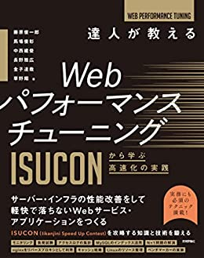

# ISUCON本ゆる読書会 #2
## Chapter 3 基礎的な負荷試験

Eitaro
2022年8月20日

---
# 今日の資料

---
# 負荷試験・ベンチマーカーとは

---
# private-isuの場合

---
# 動作環境

---
# 実行の様子

---
# nginxのアクセスログの集計
JSON形式に変更が必要

---
# シークエンス図
request_timeとUpstream_response_time

---
# alpを使ったログ解析

---
# abコマンド（Apache Bench）

---
# ログのローテーション方法
1. nginxを再起動もしくはリロードする
2. nginxのmasterプロセスにシグナルを送信する

---
# パフォーマンスチューニングの流れ
1. ベンチマーカーでWebサービスに負荷をかける
2. ベンチマーカーによる計測結果を把握する
3. 負荷試験実行中にWebサービスを実行している環境の負荷を観察する
4. CPUなどのリソースを多く使用している要素を把握する
5. Webアプリケーションのコードやミドルウェアの設定を修正する
6. 1に戻る

---
# MySQLのボトルネックを発見する（スロークエリログの解析）

---
# 複数のCPUを有効に利用するための設定

---
# まとめ
性能改善したいWebサービスに対して以下のサイクルを学んだ
- Webアプリケーションで性能を計測するログの出力と集計方法
- ベンチマーカーによって負荷を与える方法
- 負荷試験中のサーバーリソースモニタリング
- ログの解析によるボトルネックの発見
- データベースへのインデックス付与による性能改善

---
# Reference

#### [達人が教えるWebパフォーマンスチューニング　〜ISUCONから学ぶ高速化の実践](https://amzn.to/3A3cZI8)
---
#

---
#

---
