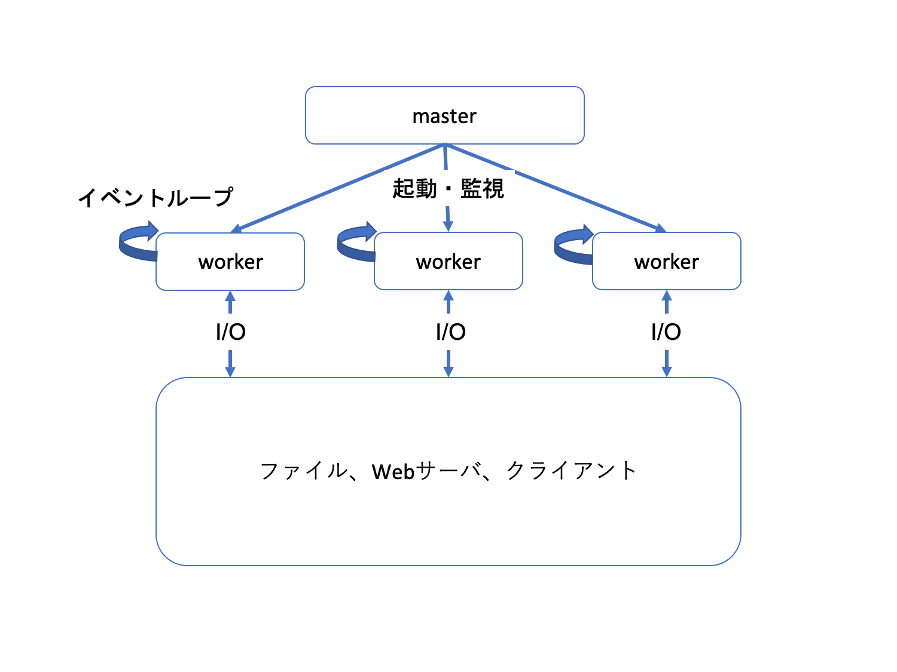

# ISUCON本ゆる輪読会#8 

## 1. リバースプロキシを前段に置く理由
リバースプロキシとは、クライアントからのWebアクセスを別のWebサーバに転送するサーバを指す。複数の転送先に負荷を分散するリバースプロキシを特にロードバランサと呼ぶ。
### 1.1 アプリケーションとプロセス・スレッドについて
- 負荷分散（ロードバランス）
- コンテンツのキャッシュ
- HTTPS通信の終端

### 1.2 リバースプロキシで得られるメリット
- 転送時のデータ圧縮
- リクエストとレスポンスのバッファリング
- リバースプロキシとアップストリームサーバー間でのコネクション管理

## 2. nginxの基礎
### 2.1 C10K問題とは

### 2.2 nginxについて
nginxは、Webサーバやロードバランサ、リバースプロキシなどの機能を持つオープンソースソフトウェアである。
Webサーバとしては、Microsoft Internet Information Services（IIS）Apache HTTP Serverと並んで最も広く利用されている。
nginxには主に以下の３つの使い方がある。
   - 静的なコンテンツのWebサーバ
   - 動的なコンテンツのWebサーバ
   - ロードバランサ、リバースプロキシ
nginxはロードバランサ、リバースプロキシの設定が容易で、HTTPSの処理を担当させて、暗号化を解いた状態で、別のWebサーバにアクセス転送するような使い方もある。
以下のような特徴があり、選ばれている。
- 設定ファイルの構造がシンプル
- 動作に必要なリソースが少なく、安定動作する
- アクセス性能が高く、高負荷になっても性能が落ちにくい
- 新機能（HTTP/2、WebSocketなど）に対する対応が早い

### 2.3 nginxの構成
nginxを起動すると、２種類のプロセスが起動していることが分かる。psコマンドで確認すると、プロセス名が「nginx: master process」「nginx: worker process」となっており、masterはrootユーザーで起動し、workerは「nginx」や「www」といった名前の一般ユーザーで起動している。masterは設定ファイルを読み込み、ネトワークの通信に使うソケットの待ち受けを設定し、workerを起動・監視する。workerはネットワーク処理のイベントループを処理し、masterが待ち受けを設定したソケットを使って接続を受付け、ネットワークやファイルI/Oを実施する。HTTPやSSL/TLSのプロトコル処理もworkerの仕事。

nginxは内部で機能ごとのモジュールに分かれており、コンパイル時のフラグによって組み込むモジュールを選択できる。

### 2.4 nginxの基本操作
- インストールされたパッケージのバージョンを確認するコマンド  
`rpm -qi nginx`  
- インストールされたパッケージに含まれるファイルを表示するコマンド   
`rpm -ql nginx`  
  
**ディレクトリ構成**
| ディレクトリ・ファイル名 | 内容 |
| -- | -- |
| /etc/logrotate.d/nginx | ログのローテーションの設定ファイル |
| /etc/nginx | nginxの設定ファイルが置かれるディレクトリ |
| /etc/sysconfig/nginx | nginxの起動オプションを記述する設定ファイル。現在は使われていない。|
| /usr/lib/systemd/system/nginx.service | systemdの設定ファイルで起動スクリプトに当たる。|
| /var/cache/nginx | キャッシュファイルが置かれるディレクトリ |
| /var/log/nginx | ログファイルが置かれるディレクトリ |

**設定ファイル**
/etc/nginxディレクトリには以下のようなファイルが配置されている。
| ファイル名 | 内容 |
| -- | -- |
| nginx.conf | 最初に読み込まれる設定ファイル。他の設定ファイルはこのファイルから読み込まれる。 |
| mime.types | ファイルの拡張子とContent-Typeのマッピングテーブル。|
| conf.d/default.conf | ポート番号やドキュメントルートの設定など、基本的なWebサーバーとしての設定。|
nginxの設定ファイルはincludeによって他の設定ファイルを読み込めるようになっているため、関連する設定は別のファイルにまとめて書き出すのが一般的。rpmファイルには複数の設定ファイルが入っているが、nginx.confで読み込む設定をしなければ利用されず、デフォルトでは`mine.types`と`conf.d/*.conf`だけ。
**起動、終了、再起動、設定ファイルの再読み込み**
- 開始: `systemctl start nginx`
- 終了: `systemctl stop nginx`
- 再起動: `systemctl restart nginx`、nginxを停止させるためリクエストを受け付けできない時間が一瞬発生する
- 設定の再読み込み: `systemctl reload nginx`、新たなworkerプロセスを新たな設定で起動してから、古い設定のworkerプロセスでリクエスト処理中でないものを順次終了するため、リクエストを受け付けできない時間が発生しない。
- アップグレード（バイナリ入れ替え）: `/sbin/service nginx upgrade`、新たなmaster/workerプロセスを起動してから古いmaster/workerプロセスでリクエスト処理中でないものを順次終了するためリクエスト受付できない時間が発生しない。アップデート時に自動的に実行される。
- 状態表示: `systemctl status nginx`、コンソールに出力したログや起動状態を表示する。`-l`オプションをつけると省略せずにすべての行を表示する。起動に失敗する場合など、このコマンドからエラーログを確認できる。

### 2.5 nginxのログファイル
nginxのログファイルにはアクセスログとエラーログの２種類がある。
デフォルトではアクセスログが`/var/log/nginx/access.log`、エラーログが`/var/log/nginx/error.log`に設定されている。
これらのログファイルはloglotateプログラムで毎晩ローテートされ、古いログは圧縮されていく。ファイル名の末尾には日付を示す文字列がつく。gzipで圧縮され、52日分以上のログファイルが貯まると、自動的に古いものから削除されていく。設定ファイルは`/etc/logrotate.d/nginx`。

### 2.5 nginxの設定確認
``` /etc/nginx/nginx.conf
include /etc/nginx/conf.d/*.conf;
include /etc/nginx/sites-enabled/*;
```

``` /etc/nginx/sites-available/isucon.conf
server {
    listen 80;

    client_max_body_size 10m;
    root /home/isucon/private_isu/webapp/public;
    location / {
        proxy_set_header Host $host;
        proxy_pass http://localhost8080;
    }
}
```

静的ファイルの配信をアプリケーションサーバーからnginx経由で行うように切り替えることでアプリケーションサーバーへの負荷を減らす。
``` /etc/nginx/sites-available/isucon.conf
server {
    listen 80;

    client_max_body_size 10m;
    root /home/isucon/private_isu/webapp/public;

    location /css/ {
        root /home/isucon/private_isu/webapp/public/;
        expires 1d;
    }

    location /js/ {
        root /home/isucon/private_isu/webapp/public/;
    }

    location / {
        proxy_set_header Host $host;
        proxy_pass http://localhost8080;
    }
}
```
公開するディレクトリをURLのパスにマッピングしている。

## 3. nginxを活用した高速化手法
### 3.1 転送時のデータ圧縮

```
gzip on;
    gzip_types text/css text/javascript application/javascript application/x-javascript application/json;
gzip_min_length 1k;
```

### 3.2 リクエスト・レスポンスのキャッシング・バッファリング
キャッシュ処理をうまく使うとバックエンドの負荷を下げ、性能を向上させられる。
記述の例は以下。
```
http {
    proxy_cache_path /var/cache/nginx/rproxy
                    levels=1:2 keys_zone=proxy1:10m
                    inactive=1d;

    upstream backend {
        server 192.168.1.10;
    }
    
    server {
        ...
        location / {
            proxy_cache proxy1;
            proxy_pass http://backend;
        }
    }
}
```
- key_zone: key_zoneはzone名とサイズを指定する。ゾーンはnginxの複数のworkerで共有するメモリ領域のことで、名前をつけて区別することが出来る。ゾーンのメモリ領域の大きさを指定することで、キャッシュに保持できるファイルの数が決まり、ゾーン容量1MBあたり約8000個のキーを保持できる。ゾーンに置かれるのはハッシュキーだけで、キャッシュデータ全体のサイズはこの値よりも大きくなる。
- levels: proxy_cache_pathのlevels引数は、キャッシュディレクトリの構造を示す。「level=1:2」を指定すると、第一階層に0〜9の１文字、第二階層に00〜99までの２文字でディレクトリを作成し、キャッシュファイル名とディレクトリ名を一致させて分散させることができる。
- inactive: キャッシュがアクセスされなくなってから捨てられるまでの時間を指定する。デフォルトは10分。
- max_size: キャッシュ全体のサイズを指定する。この値以上になると、古いファイルから順に削除する。削除処理の間に一時的にmax_size以上になることもある。


### 3.3 アップストリームサーバーとのコネクション管理
```/etc/nginx/sites-available/isucon.conf
location / {
    proxy_http_version 1.1;
    proxy_set_header connection "";
    proxy_pass http://app;

}
```

```
upstream app {
    server localhost:8080;
    keepalive 32;
    keepalive_requests 1000;
}
```

### 3.4 TLS通信の高速化
ssl_session_cacheでSSLセッションキャッシュをどのように扱うかとそのキャッシュサイズを指定できる。
|  値 |  意味  |
| ---- | ---- |
|  off  |  セッションの再利用を明示的に禁止。 |
|  none  | クライアントにはセッションの再利用を明示的に禁止はしないが、実際には利用不可。デフォルト設定 |
|  builtin  | OpenSSL組み込みを利用。一つのワーカープロセスのみが利用可能。 |
|  shared  | すべてのワーカープロセスで共有。「shared:名前:サイズ」の形式で記述。 |

```
ssl_session_cache shared:SSL:10m # キャッシュサイズを10MBに設定
```

### 3.5　分散方式
upstreamコンテキストで定義されるバックエンドサーバが複数ある場合、オプションを指定しない場合は、バクエンドに順番にアクセスを割り当てるラウンドロビンで負荷が分散される。バックエンドがダウンしている場合は他のサーバが自動的に選択されることで冗長性が高まる。
パラメータを指定することで、負荷分散の方式を変更することができる。
- 重み付け
以下のようにすると負荷に偏りを持たせることができる
```
upstream backend {
    server 192.168.1.10 weight=2;
    server 192.168.1.11 weight=1;
    server 192.168.1.12; # デフォルトはweight=1と同じ
}
```
- 稼働系と待機系
負荷分散のためでなく、冗長性を持たせてバックアップサーバとして使いたい場
```
upstream backend {
    server 192.168.1.10;
    server 192.168.1.11 backup;
```

- 接続数による負荷分散
アクセスされるリソースによってバックエンドの負荷が違う場合、ラウンドロビンで割り振ると思いアクセスが特定のサーバに偏ってしまう。負荷は接続数で概算することができるため、以下のようにleast_connを指定するとアクセスがあった時点で既存の接続数が最も小さいサーバを選択するようになる。
```
upstream backend {
    least_conn;
    server 192.168.1.10;
    server 192.168.1.11;
```