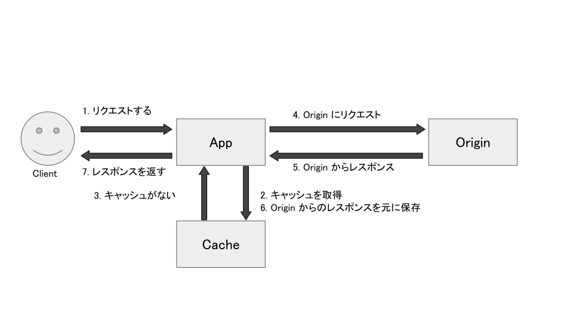
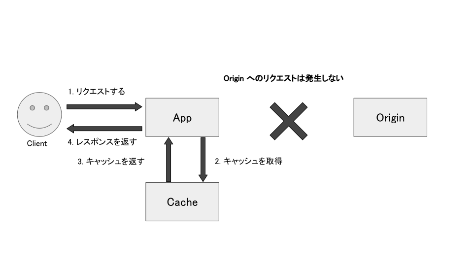
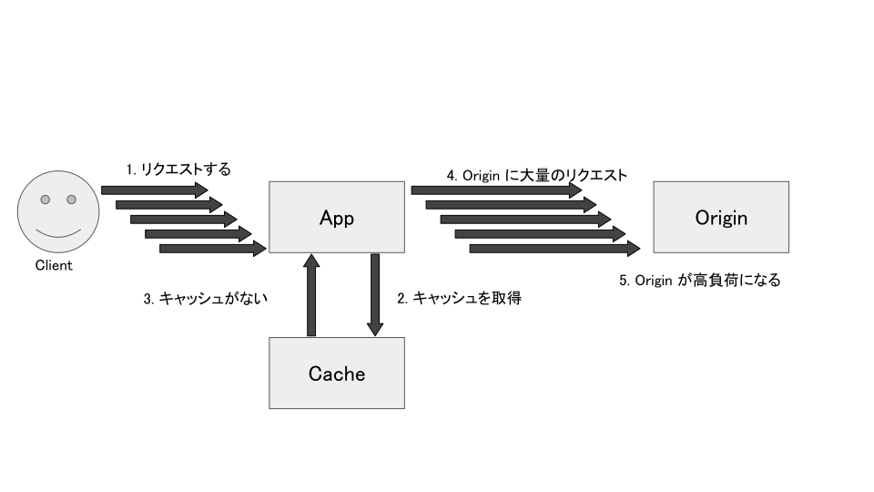
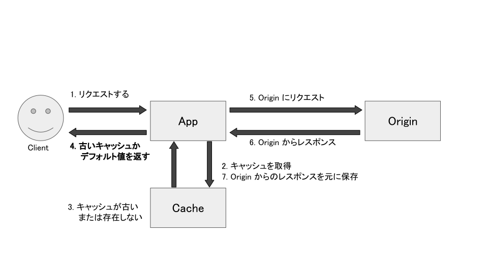
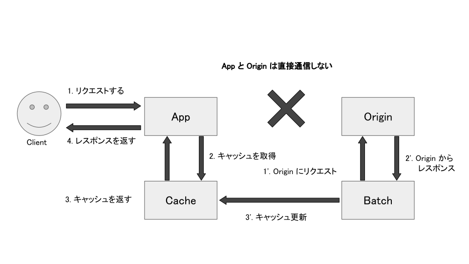

# ISUCON本ゆる輪読会#9

## 1. Web サービスにおけるキャッシュ
頻繁に更新処理が行われないようなデータは、そのデータをキャッシュすることでデータベースや外部 API へのアクセスを抑え、高速化につながる場合がある。

しかし、キャッシュは扱いが難しく、バグを生みやすい。キャッシュによって生じたバグをデバッグするのもまた大変。本当に必要なところにおいてのみ使うべき。

Web アプリケーションにおけるキャッシュは、主に次の 2 つがある：
- アプリケーションレイヤでのキャッシュ：高速なストレージ経由で返す
- HTTP レイヤでのキャッシュ：そもそもレスポンスを返さない

今回はアプリケーションレイヤでのキャッシュの話をする。

## 2. キャッシュデータ保存に利用されるミドルウェア

### 2.1 必要機能
基本的に、以下の 2 つの機能が必要：
- key から value が取得できる KVS としての機能
- TTL (Time To Live) を定められ、TTL が過ぎたらデータを削除する機能
  - stale になってしまったデータを自動で削除するため

### 2.2 memcached と Redis
Web アプリケーションのキャッシュとしてよく利用されるミドルウェアとして、memcached と Redis がある。
以下が簡単な比較:

| 機能 | memcached | Redis |
| :--- | :--- | :--- |
| パフォーマンス | 非常に高い | 高い |
| ストレージ永続化 | 基本的に不可 | 可 |
| レプリケーション | 不可| 可 |
| 機能 | 少ない | 多い |

Redis の方がレプリケーションやストレージ永続化などができ多機能ではあるが、ISUCON では memcached で十分そう？

### 2.3 インメモリキャッシュとファイルキャッシュ
キャッシュデータをインメモリに保存する方法もある。
この方法だとミドルウェアとの通信コストが不要になるため Web アプリケーション上で高速に動作する。

以下の点に注意する必要がある:
- シングルプロセス・マルチスレッドのアーキテクチャの場合、キャッシュの読み書きの際に適切にロックを取る必要がある
  - Go では sync.Mutex パッケージなどを利用して実装できる
- マルチプロセス・シングルスレッドのアーキテクチャの場合、簡単にはプロセス間でメモリを共有できない
  - 過去の ISUCON でハマったことあり
- 実装によっては TTL を自分で実装する必要がある

また、インメモリキャッシュは以下のようなデメリットがある
- デプロイした時やサーバー追加時にキャッシュがないため、デプロイした直後のパフォーマンス劣化やデプロイ直後に Thundering herd problem が発生し、データベースなどに負荷が集中する場合がある
- 問題のあるデータをキャッシュしたときに簡単に消せないことが多い

キャッシュをサーバー上のファイルに保存することもできる。こちらもサーバー追加時にキャッシュがない状態から始まるため、インメモリキャッシュと同様のデメリットがある。

以上のようにインメモリやファイルによるキャッシュは使いにくいので、基本的には専用のミドルウェアにキャッシュを保存しておき、インメモリやファイルのキャッシュは、ミドルウェアへのアクセスを減らしたいときに補助的に利用するのがよい。

また、これらのキャッシュは以下の理由から TTL を短めにする必要がある：
- 問題のあるデータをキャッシュしたときに簡単に消せないため短い時間でキャッシュを破棄した方が扱いやすいから
- ミドルウェアの補助としてインメモリキャッシュを使う場合、最大でミドルウェア上のキャッシュの TTL とインメモリキャッシュ上の TTL の合計時間がキャッシュとして利用される期間になるため、インメモリキャッシュの TTL を短めにしておかないと古いキャッシュが長期間使い回される可能性があるから

## 3. キャッシュを KVS に保存する際の注意点
適切なキーを定めることが重要。以下がアンチパターン：
- 違うデータを保存するときに同じキーを利用する
  - データが衝突して片方のデータしか参照できなくなる
- 同じデータを大量の異なるキーに保存する
  - データが増え過ぎてキャッシュを保存する KVS のメモリやディスク容量が枯渇する可能性がある

おそらく ISUCON では必要ないが、キャッシュを外に保存したいとき、そのままではできないのでシリアライズ化しなければいけないことに注意。

## 4. いつキャッシュを利用するか
以下がメリット：
- CPU への負荷が大きな処理や時間がかかる処理の実行回数を抑えられるので、パフォ＝マンスが上がる
  - インフラコストも下げられる
  - 外部 API を利用している場合は、その呼び出し回数に制限があることが多いので、その場合はその制限に達しないためにキャッシュを利用する必要がある
- 大量のリクエストに耐えられる仕組みが比較的容易に作れる

いいことばかりのように聞こえるが、実際にはキャッシュの実装は大変難しく以下のような問題が発生しうる：
- 古いデータが表示されることがある
  - データ上不整合が発生することがある
  - データ更新時にキャッシュの更新・削除を行うことである程度軽減可能
- キャッシュを保存するミドルウェアが新しい Web サービス上の障害点となる
- 想定外のデータを表示してしまい、情報流出につながる可能性がある
- プログラムの実装が複雑になるため、デバッグが難しくなる
- キャッシュに乗っていないタイミングで大量にリクエストが来ると、実装によってはキャッシュ生成の重い処理が大量に同時実行されることがある
  - Thundering herd problem と呼ばれる問題で詳しくは後述

これらの問題を考えても、導入するメリットが上回ると考えられるときにのみキャッシュを利用すべき。まずはキャッシュを使わない方法を模索するのが先。スロークエリになるなら、クエリを変えてスロークエリにならない方法を考えたり、外部 API を使っているならそれに頼らずに済む方法を考える。

それでも解決できず、キャッシュのデメリットを理解した上で導入するのであれば、以下の点を考慮に入れるとよい：
- データの不整合がどこまで許されるか
  - 決済情報などの重要なデータは不整合が許されないのでキャッシュを使うべきではない
  - 更新したはずのデータが更新されていないとユーザからバグを疑われる
- データの特性上、本当にキャッシュを使う必要があるか
  - ユーザー情報などはユーザーごとにキャッシュが分散するので、有効にキャッシュを使えない可能性がある
  - 有効に使えないキャッシュが増えると、キャッシュの容量が無駄に増えてしまう可能性がある
  - ユーザー情報を取り違えると重大なセキュリティリスクにつながる可能性がある
- データの更新頻度はどの程度か
  - データが頻繁に更新される場合、キャッシュをしても有効に活用できない可能性がある
  - データの鮮度が重要な機能な場合、更新頻度が低いとユーザ体験が悪化する
- データの生成コストを考えているか
  - 生成コストが低いならそもそもキャッシュを使わなくてよい
  - 生成コストが高すぎる場合、キャッシュデータが失われると長期間復旧できないため、生成結果を RDBMS などデータが失われにくいデータベースに保存する必要がある

### 4.1 十分短い TTL を設定する
キャッシュを導入する場合、適切な TTL の設定について考える必要がある。例えば、TTL が 1 時間であれば意図的に書き換えない限り一度保存したキャッシュは 1 時間有効になる。

TTL が長ければ長いほどパフォーマンス上のメリットは大きくなるが、その間は（意図的に書き換えない限り）キャッシュのデータが更新されないので実際のデータが更新されたとしても古いキャッシュのデータが表示されてしまう。これを解決するためには、

- データの特性を考えて、十分短い TTL を設定する
- データが更新されたときにキャッシュも同時に更新するようにする

多くの場合、十分短い TTL を設定することが勧められる。データが更新されたときにキャッシュも同時に更新する実装はデータの二重管理になるので実装が複雑になる。

## 5. 具体的なキャッシュ実装方法
今回の例は全てインメモリキャッシュ

### 5.1 キャッシュにデータがなければキャッシュを生成して生成結果を保存する方法
別名 Broker パターン。最もシンプル。最初に Client が App にリクエストをして、キャッシュにデータがあればデータを返し、なければキャッシュを生成して生成結果を保存する手法。

図1 キャッシュにデータがない場合のリクエスト



図2 キャッシュにデータがある場合のリクエスト



Pros:
- 実装が単純でデータの整合性も保ちやすい
- アクセスがあったものだけキャッシュを生成するため効率的

Cons:
- 初回アクセスやキャッシュがなくなったタイミングでリクエストした場合のレスポンスは遅い
- キャッシュに乗っていないタイミングで大量にリクエストが来ると重い処理が大量に同時実行される
  - App 上や App と Origin の間にあるミドルウェアなどで制御しないとキャッシュ生成中に Origin に対してリクエストが集中することがある
    - Thundering herd problem と呼ばれる問題
  - memcached のように再起動するとデータが消えるミドルウェアを使っている場合、再起動してキャッシュが消えたときに Origin に対してリクエストが集中する
  - インメモリキャッシュなど実装方法によってはデプロイやサーバー投入時などにキャッシュがなくなるため、そのタイミングで Origin に対してリクエストが集中する

#### hands-on
```
$ docker container run --name go-container -it golang &
$ docker cp broker.go go-container:/go/src
$ docker container attach go-container
# cd src
# go run broker.go
```

#### 5.1.2 Thundering herd problem とは何か
キャッシュを導入することによって発生する新たな問題。
先程の手法でキャッシュに乗っていないタイミングで同時に大量のリクエストを送った場合どうなるか考えてみる。一気に大量のリクエストが Origin に送られてしまい、この状況はキャッシュが生成されるまで続くため、大量のリクエストが App に来るかつキャッシュがすぐに生成できない状況の場合 Origin へのリクエストが大量に発生する。

キャッシュの対象になるコンテンツはスロークエリになるなど、そもそも Origin からのレスポンスが遅いものが多いため、この問題は容易に発生しうる。

図3 キャッシュがないコンテンツに同時に大量のリクエストが来た場合



この状況は、システムに突然同時に大量の雷が発生したように見えることから **Thundering herd problem** と呼ばれるようになった。
この Broker パターンでは、Thundering herd problem を回避することはできない。

Web アプリケーション上のキャッシュではないが、nginx では `proxy_cache_lock` という設定があり、有効にすると 1 つのリクエストがキャッシュの更新をする間は `proxy_cache_key` が同一のリクエストをブロックする。nginx でキャッシュする設定にしているのみに有効だが、これを用いて Thundering herd problem を回避することができる。

### 5.2 キャッシュがなければデフォルト値や古いキャッシュを返し、非同期にキャッシュ更新処理を実行する
別名 Inventory パターン。

図4 キャッシュがない場合、非同期にキャッシュを更新する



#### 5.2.1 hands-on
```
$ docker container start go-container
$ docker cp inventory.go go-container:/go/src
$ docker container attach go-container
# cd /go/src
# go run intentory.go
```

Pros:
- レスポンスはほとんどのケースで高速に返せる
- アクセスがあったものだけキャッシュを生成するため効率的

Cons:
- ロジックが複雑
  - キャッシュの更新が非同期なため、非同期に処理を実行する仕組みが必要
  - キャッシュがなければデフォルト値を返す実装の場合、キャッシュがないタイミングでアクセスした人には適切なレスポンスを返せない
    - 古いキャッシュを返す場合も、本来では使うべきでないデータを返している
  - Thundering herd problem は解決していない
    - キャッシュ更新時の処理が複数実行されないようにする仕組みは別に必要
    - Go では `glang.org/x/sync/singleflight` を使用することで同時に発生した複数の呼び出しを 1 つにまとめることができる

### 5.3 バッチ処理などで定期的にキャッシュを更新する
バッチ処理などで定期的にキャッシュを更新する手法もある。別名 Warmer パターン

図5 バッチ経由で定期的にキャッシュを更新する



Pros:
- 実装は比較的簡単
- Thundering herd problem が発生しない

Cons:
- バッチで生成できるデータにしか使えない
- アクセスがほぼ来ないデータも事前に生成する必要があるのでほぼ使われないキャッシュも管理する必要がある
- 障害でキャッシュが揮発したときに復旧に時間がかかる可能性がある
  - キャッシュが存在しなければデータを取得できないためエラーになる
  - バッチを実行すれば復旧できるはずだが、実行する必要があるバッチが大量にある場合は復旧の難易度が高い

### 5.4 memcached を用いた private-isu のキャッシング
もし時間があれば

## 6. キャッシュを監視する
キャッシュを利用する場合は、キャッシュが適切に使われているかを監視する必要があり、特に以下の2つは重要：
- expire していないのにキャッシュから追い出されたアイテム数 (evicted items)
  - キャッシュ容量は有限なため、容量を超えるデータを保存しようとする場合 expire 前のデータを削除することが多い
  - これが多い場合、キャッシュ容量が足りず、適切にキャッシュを利用できていない可能性がある
- キャッシュヒット率 (cache-hit ratio)
  - 当然この値が高ければ高いほどキャッシュの効率が良いことになる

memcached か Redis を利用している場合、以下の設定を確認するとよい：
- memcached の stats コマンドの以下の項目：
  - `evictions`, `get_hits`, `get_misses`
- Redis の INFO コマンドの以下の項目：
  - `evicted_keys`, `keyspace_hits`, `keyspace_misses`

## 7. まとめ
本章では以下のことについて学んだ。
- キャッシュの保存に利用するミドルウェア
- キャッシュを使うタイミング
- キャッシュの手法
- Thundering herd problem など、キャッシュの利用時に発生する問題や注意点
- キャッシュの監視

## 8. 参考文献
- [達人が教えるWebパフォーマンスチューニング〜ISUCONから学ぶ高速化の実践](https://gihyo.jp/book/2022/978-4-297-12846-3)
- [Webアプリケーションのキャッシュ戦略とそのパターン](https://speakerdeck.com/moznion/pattern-and-strategy-of-web-application-caching)