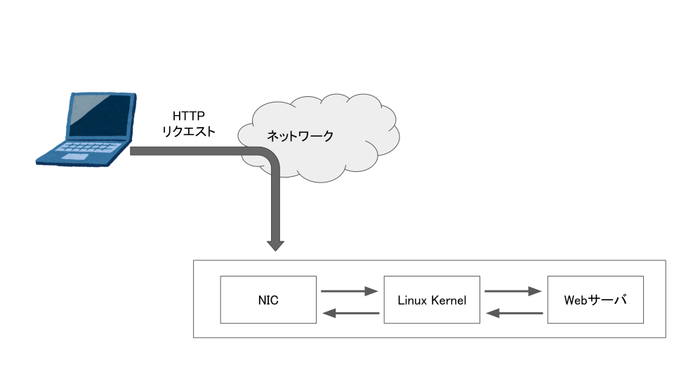
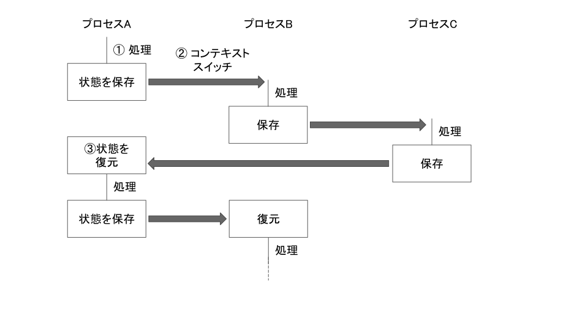

# ISUCON ゆる輪読会#10
## 9.1 なぜ OS を学ぶのか？
OS はアプリケーションやデータベースにハードウェアリソースを提供する、いわば土台のような存在。
OS の動作をある程度学ぶことで、アプリケーションやデータベースがなぜ遅くなっているかについての解像度を高め、チューニングがより確実に進められることが期待できる。

本章では Linux をメインターゲットとして扱う。前半では Linux においてどのような高速化の取り組みが行われているかを紹介し、後半では具体的に遭遇することの多いトラブル及びそれに対するチューニングテクニックについて紹介する。

### 9.1.1 カーネルパラメータ
Linux は**カーネルパラメータ**という、OS のソースコードを書き換えデプロイすることなしに挙動を変える機能がある。これらの設定を変更することで大体の場合に対応することができる。

## 9.2 Linux Kernel の基礎知識
Linux では OS としてのコア機能を Linux Kernel というソフトウェアが担っている。OS 上で動作するアプリケーションは**システムコール**という命令を用いて Linux Kernel の機能を利用できる。

システムコールはアプリケーションへ OS のコア機能のインターフェースを提供しており、これによってアプリ側では様々なハードウェアごとの違いなど、OS 上で動作するアプリケーションがそれ以下のレイヤーにおける違いを意識することなく利用できるようになっている。

日常的に利用しているコマンドも、実は多くのシステムコールを用いている。例えば、`ls` では 100 個以上ものシステムコールが用いられている。Linux では、`strace` というコマンドを用いてコマンドが用いているシステムコールを表示することができる。

まずは Linux 環境を実現するために multipass で仮装マシンを立てる。

```
$ cd ./enshu
$ multipass launch --name enshu --cpus 1 --disk 8G --mem 2G --cloud-init enshu.cfg 20.04
$ multipass shell enshu
```

```
$ strace ls
execve("/usr/bin/ls", ["ls"], 0x7ffc203c0300 /* 23 vars */) = 0
brk(NULL)                               = 0x557826d5e000
arch_prctl(0x3001 /* ARCH_??? */, 0x7ffcbe1808e0) = -1 EINVAL (Invalid argument)
access("/etc/ld.so.preload", R_OK)      = -1 ENOENT (No such file or directory)
openat(AT_FDCWD, "/etc/ld.so.cache", O_RDONLY|O_CLOEXEC) = 3
...
close(2)                                = 0
exit_group(0)                           = ?
+++ exited with 0 +++
```

システムコールの一例として、`open(2)` がある。これは Linux においてアプリケーションから取り扱うためのファイルを開いたり作成したりするシステムコールである。`man` コマンドを用いて詳しいマニュアルを見ることができる:
```
$ sudo apt-get install manpages-dev
$ man 2 open
OPEN(2)                   Linux Programmer's Manual                  OPEN(2)

NAME
       open, openat, creat - open and possibly create a file

SYNOPSIS
       #include <sys/types.h>
       #include <sys/stat.h>
       #include <fcntl.h>

       int open(const char *pathname, int flags);
       int open(const char *pathname, int flags, mode_t mode);

       int creat(const char *pathname, mode_t mode);

       int openat(int dirfd, const char *pathname, int flags);
       int openat(int dirfd, const char *pathname, int flags, mode_t mode);
...
```
`open(2)` の 2 は、Linux man pages (Linux におけるマニュアル) の章番号を表している。`open` という文字列を用いている Linux 関連のシステムは多くあるため、その中でどれを指しているか明確にするために章番号をつけて表記することがある。以下が章番号と内容の対応の抜粋である。

| 章番号 | 概要 |
| :---: | :---: |
| 1 | Linux 上のユーザが実行できるコマンド |
| 2 | システムコール |
| 3 | C 言語で実装されたライブラリ |
| 8 | Linux 上の管理者権限を持ったユーザが実行できるコマンド |

`open` 関数は開きたいファイルパス (`pathname`)、開くためのフラグ (`flags`)、開く際の挙動を指定するモード (`mode_t`) を引数に持つ。`flags` はそのファイルを読み込みだけ (`O_RDONLY`) か、書き込みだけ (`O_WRONLY`) か、読み書き (`O_RDWR`) どちらも行うかの指定を行う。`mode_t` は、ファイルを書き込む際にファイルの最後から追記を行うモード (`O_APPEND`) や、ファイルが存在しなかった場合に開く前に作成するモード (`O_CREAT`) モードなどがある。  
どの引数においても読み書きするファイルのファイルシステムや、ハードウェアの情報を指定することはない。システムコールがうまくハードウェアや OS レイヤーのシステムを隠蔽できている一例。

これらの隠蔽されたシステムコールを境界として、Linux Kernel 側を**カーネル空間**、システムコールを利用する Linux OS 上のアプリケーションが動作する部分を**ユーザ空間**と呼ぶ。カーネル空間で処理が完結する場合は、ユーザ空間と比べてオーバーヘッドが少なく、より高速に動作する傾向にある。そのため、ミドルウェアなど速度が要求されるアプリケーションは直接カーネル空間で処理を行うよう実装する場合もある。

## 9.3 Linux のプロセス管理
ユーザー間で動作するアプリケーションは全て**プロセス**として扱われる。`ps` コマンドを用いることで動作しているプロセスの一覧を確認できる。
```
$ ps axufww
root        1617  0.0  0.3  12176  7464 ?        Ss   Nov22   0:00 sshd: /usr/sbin/sshd -D [listener] 0 of 10-100 startups
root       16702  0.0  0.4  13796  8992 ?        Ss   Nov22   0:00  \_ sshd: ubuntu [priv]
ubuntu     16792  0.0  0.3  13928  6104 ?        S    Nov22   0:00      \_ sshd: ubuntu@pts/0
ubuntu     16793  0.0  0.2  10032  5108 pts/0    Ss   Nov22   0:00          \_ -bash
ubuntu     20412  0.0  0.1  10772  3292 pts/0    R+   00:00   0:00              \_ ps axufww
```

**PID** (Process ID) は各プロセスごとに割り振られるユニークな ID で、プロセスが起動するごとに PID がインクリメントされて値が割り振られる。PID が 1 である Linux において最初に起動されるプロセスは **init** と呼ばれている。Linux においてはプロセスは親子関係があり、プロセスを起動するためには親プロセスを元にして子プロセスを作成する。そのすべてのプロセスの親となるのが **init** である。近年では init の実装として `systemd` が多く用いられている。

親プロセスが小プロセスを生成することを、用いるシステムコール `fork` からちなんで 「fork する」という。`fork(2)` は自らのプロセスをコピーし、その後 `execve(2)` というシステムコールを用いてバイナリを実行することで子プロセスを作成することができる。

Linux では、CPU やメモリなどのリソースはプロセスごとに割り振られているため、子プロセスを作成することで、そのプロセス専用に独立したリソース空間の構築と確保ができる。ここで割り当てられる CPU やメモリは、「仮想 CPU」「仮装メモリ」と呼ばれる Linux Kernel 上で仮装化されたリソースである。Linux Kernel 上でリソースを仮装化することで、ユーザ空間のプロセスは実メモリを意識することなく効率的にリソースを利用できる。

このようにプロセス間のリソースは分離されているが、プロセス間には 1 つ以上の**スレッド**を持つことができる。処理はスレッド単位で行うことができるので、複数スレッドを用いることで並列処理が実現できる。また、プロセスと違い、同プロセス内にあるスレッドは同じリソースを使うことができる。

## 9.4 Linux のネットワーク
### 9.4.1 ネットワークのメトリクス
ネットワークにおいて重要なメトリクスとして、スループットとレイテンシがある。スループットは同時に処理できる量、レイテンシはネットワーク通信を処理するためにかかった時間を指す。

ネットワーク通信は通信先のマシン、2点間をつなぐネットワーク経路、信号を処理する NIC (Network Interface Card)、Linux Kernel を介して自分のアプリケーションまで届くため、ネットワークのメトリクスはこれらのいずれかの性能が変わると変わりうることに注意。改善したい場合は利用しているネットワークの変更を検討し、自社でネットワークを設計している場合はアーキテクチャや利用しているハードウェアを再検討する。



## 9.4.2 Linux Kernel におけるパケット処理の効率化
Web アプリケーションにおいて、受信側ホストはどのタイミングでパケットが受信されるかを事前に予測することはできないため、Linux Kernel はパケットを NIC から受け取った段階で CPU に対して「即座にパケットを処理せよ」という割り込み命令を出す。これは **Inturrupt** と呼ばれている。

一般に、1 つの CPU は複数の演算を完全に同時には行うことができないため、複数のプロセスを動作させるために超高速に処理するプロセスを切り替えることで疑似的に同時にプロセスが動作しているように見せるというアプローチを採用している。これを実現するために **コンテキストスイッチ** という概念を導入している。



プロセス A の処理を行なっている間、他のプロセスの処理を行うことはできないため、高速にプロセス A の処理を行い (①)、その状態を保存した上でプロセス B に切り替えを行う (②)。また、プロセス A に再度戻ってきた際には以前保存しておいた状態を復元し (③)、そのプロセス処理を再度行う。この切り替えにかかる時間を**コンテキストスイッチコスト**と呼ぶ。

このようなアーキテクチャをとっている場合に、どのタイミングで届くかわからないパケットの処理はいつ行えばよいだろうか。一定のタイミングでパケットが届いているのかを確認する polling が考えられるが、実際に確認する必要なないタイミングが多くなってしまうため非効率。これを効率化するために「Interrupt」という概念が利用される。NIC などのハードウェアデバイスに対して定期的な確認を行わず、Inturrupt が届いたタイミングでのみプロセス処理の順番に割り込んで処理を行う。こうすることで、より効率的にパケット処理を行うことができる。

Interrupt の中にもいくつかの種類が存在しており、パケット処理やキーボード入力など即時処理が必要なものをハードウェア割り込み、割り込みの中でも遅れて実行するものをソフト割り込みと定義されている。パケット処理においてはパケットが受信した時に発生するものにハードウェア割り込み、その後の TCP/UDP などのプロトコルを解釈する処理にソフト割り込みを利用している。

パケット処理 1 つ 1 つはそれほど CPU 負荷が高くないが、NIC は性能向上に伴い大量のパケットを高速に捌けるようになってきた。そのため、そのままでは大量の割り込みが発生してしまう。これに対処するため、Linux Kernel を始めとするソフトウェア側 (e.g., Linux NAPI)、NIC などのハードウェア側 (e.g., RSS) ともに多くの説明がなされている。

## 9.5 Linux のディスク I/O
ストレージへの読み書きも Linux Kernel が担う大きな役割である。本節ではストレージの概念、及び効率的な利用方法について解説する。

### 9.5.1 ストレージの種類
Linux においては HDD や SDD などのディスクを実際に読み書きするために**ファイルシステム**を利用している。いくつかの Linux ディストリビューションでは標準として ext4 や XFS、ZFS などが採用されている。他にも、ファイルを 1 つのオブジェクトという単位で管理する**オブジェクトストレージ**という方式もある。ファイルシステムのように木構造で表される構造でなく、辞書型のように、ファイルを書き込む際に ID が発行され、その ID をもとに読み書きを行うような方式となっている。

### 9.5.2 ストレージの性能とは - スループット、レイテンシ、IOPS
ストレージの性能は、スループット、レイテンシ、IOPS (Input/Output Per Second) の 3 つに大別される。スループットとレイテンシは以前の説明の通り、それぞれ一定時間に処理を行えたファイルサイズと一度処理を行う際に発生する遅延をそれぞれ意味する。

**IOPS** は名前の通り、1 秒間において何回 Input と Output、つまり読み書きができるのかについての指標である。例えば、100 IOPS が担保されているストレージの場合、1 秒に 100 個のファイルを開いて読むことができる。  
一見するとスループットと似ているが、読み書きを行うファイルサイズを考えると違いが分かりやすい。端的に言えば、小さなファイルを大量に扱う場合 IOPS を、大きなファイルを扱う場合はスループットを重視すべき。

例として、1 MB のファイルを 100 個扱う場合と、1 KB のファイルを 102400 個扱う場合を考える。どちらも結果として扱うファイルサイズは 100 MB で同一。IOPS が 100、スループットが 1 MB/sec の性能を持つストレージでこれら 2 つのケースを扱う場合を考えてみると、前者では 1 秒で処理が終わることになるが、後者では IOPS がボトルネックとなってしまい 1024 秒かかってしまう。このように、扱うファイルの種類において重視すべきストレージの性能は変わる。

### 9.5.3 ストレージの性質を調査
現在利用しているファイルシステムの性能を計測するためには、`fio` コマンドを利用できる。詳細なオプションについてはマニュアルを参照されたい。

```
$ sudo apt install -y fio
$ fio -filename=./testfile -direct=1 -rw=read -bs=4k -size=2G -runtime=10 -group_reporting -name=file
file: (g=0): rw=read, bs=(R) 4096B-4096B, (W) 4096B-4096B, (T) 4096B-4096B, ioengine=psync, iodepth=1
fio-3.16
Starting 1 process
file: Laying out IO file (1 file / 2048MiB)
Jobs: 1 (f=1): [R(1)][100.0%][r=6518KiB/s][r=1629 IOPS][eta 00m:00s]
file: (groupid=0, jobs=1): err= 0: pid=20917: Wed Nov 23 00:03:29 2022
  read: IOPS=1345, BW=5384KiB/s (5513kB/s)(52.6MiB/10001msec)
    clat (usec): min=111, max=35098, avg=730.97, stdev=3063.23
     lat (usec): min=112, max=35099, avg=731.48, stdev=3063.23
    clat percentiles (usec):
     |  1.00th=[  176],  5.00th=[  215], 10.00th=[  235], 20.00th=[  262],
     | 30.00th=[  285], 40.00th=[  306], 50.00th=[  326], 60.00th=[  351],
     | 70.00th=[  383], 80.00th=[  433], 90.00th=[  545], 95.00th=[  693],
     | 99.00th=[25560], 99.50th=[25822], 99.90th=[26346], 99.95th=[26608],
     | 99.99th=[28967]
   bw (  KiB/s): min= 4304, max= 6672, per=98.42%, avg=5297.79, stdev=823.88, samples=19
   iops        : min= 1076, max= 1668, avg=1324.37, stdev=205.88, samples=19
  lat (usec)   : 250=15.45%, 500=71.71%, 750=9.17%, 1000=1.77%
  lat (msec)   : 2=0.40%, 4=0.03%, 10=0.01%, 50=1.46%
  cpu          : usr=5.68%, sys=16.23%, ctx=13533, majf=0, minf=12
  IO depths    : 1=100.0%, 2=0.0%, 4=0.0%, 8=0.0%, 16=0.0%, 32=0.0%, >=64=0.0%
     submit    : 0=0.0%, 4=100.0%, 8=0.0%, 16=0.0%, 32=0.0%, 64=0.0%, >=64=0.0%
     complete  : 0=0.0%, 4=100.0%, 8=0.0%, 16=0.0%, 32=0.0%, 64=0.0%, >=64=0.0%
     issued rwts: total=13461,0,0,0 short=0,0,0,0 dropped=0,0,0,0
     latency   : target=0, window=0, percentile=100.00%, depth=1

Run status group 0 (all jobs):
   READ: bw=5384KiB/s (5513kB/s), 5384KiB/s-5384KiB/s (5513kB/s-5513kB/s), io=52.6MiB (55.1MB), run=10001-10001msec

Disk stats (read/write):
  vda: ios=13414/2, merge=0/1, ticks=8130/4, in_queue=3776, util=86.81%
```

出力の中で IOPS は次に対応する:
```
file: (groupid=0, jobs=1): err= 0: pid=20917: Wed Nov 23 00:03:29 2022
  read: IOPS=1345, BW=5384KiB/s (5513kB/s)(52.6MiB/10001msec)
    ...
   iops        : min= 1076, max= 1668, avg=1324.37, stdev=205.88, samples=19
```

スループットは次に対応する。bw は band width の略である:
```
file: (groupid=0, jobs=1): err= 0: pid=20917: Wed Nov 23 00:03:29 2022
  read: IOPS=1345, BW=5384KiB/s (5513kB/s)(52.6MiB/10001msec)
    ...
    bw (  KiB/s): min= 4304, max= 6672, per=98.42%, avg=5297.79, stdev=823.88, samples=19
```

レイテンシは次に対応する。lat は latency の略。`lat`、`clat`、`slat` などの表示があるがざっくり確認するだけであれば `clat` の値を見るのがよい:
```
file: (groupid=0, jobs=1): err= 0: pid=20917: Wed Nov 23 00:03:29 2022
  read: IOPS=1345, BW=5384KiB/s (5513kB/s)(52.6MiB/10001msec)
    clat (usec): min=111, max=35098, avg=730.97, stdev=3063.23
     lat (usec): min=112, max=35099, avg=731.48, stdev=3063.23
    clat percentiles (usec):
     |  1.00th=[  176],  5.00th=[  215], 10.00th=[  235], 20.00th=[  262],
     | 30.00th=[  285], 40.00th=[  306], 50.00th=[  326], 60.00th=[  351],
     | 70.00th=[  383], 80.00th=[  433], 90.00th=[  545], 95.00th=[  693],
     | 99.00th=[25560], 99.50th=[25822], 99.90th=[26346], 99.95th=[26608],
     | 99.99th=[28967]
    lat (usec)   : 250=15.45%, 500=71.71%, 750=9.17%, 1000=1.77%
    lat (msec)   : 2=0.40%, 4=0.03%, 10=0.01%, 50=1.46%
```

### 9.5.4 ディスクマウントのオプション
接続されたストレージをファイルシステムとして読み書きできるようにするためには、ディスクをマウントする必要がある。接続されたブロックストレージのことを**ブロックデバイス**と呼ぶ。  
現在、どのディレクトリにどのブロックデバイスがマウントされているのかは `lsblk` コマンドと `df` コマンドで確認できる。

```
# lsblk コマンドを用いて接続されているブロックデバイス一覧を確認する
$ lsblk
NAME    MAJ:MIN RM  SIZE RO TYPE MOUNTPOINT
loop0     7:0    0 67.8M  1 loop /snap/lxd/22753
loop1     7:1    0   48M  1 loop /snap/snapd/17336
loop2     7:2    0 63.2M  1 loop /snap/core20/1695
sr0      11:0    1   52K  0 rom
vda     252:0    0    8G  0 disk
├─vda1  252:1    0  7.9G  0 part /
├─vda14 252:14   0    4M  0 part
└─vda15 252:15   0  106M  0 part /boot/efi

# /dev/vda というブロックデバイスは / (ルートディスク) にマウントされている
$ lsblk /dev/vda
NAME    MAJ:MIN RM  SIZE RO TYPE MOUNTPOINT
vda     252:0    0    8G  0 disk
├─vda1  252:1    0  7.9G  0 part /
├─vda14 252:14   0    4M  0 part
└─vda15 252:15   0  106M  0 part /boot/efi

# ルートディスクは /dev/vda1 というブロックデバイスが ext4 というファイルシステムでマウントされている
$ df -hT /
Filesystem     Type  Size  Used Avail Use% Mounted on
/dev/vda1      ext4  7.6G  4.0G  3.7G  53% /
```

`lsblk` コマンドの結果から `/dev/vda` というブロックデバイスが存在しており、`df` コマンドの結果からそのブロックデバイスが ext4 というファイルシステムでマウントされていることがわかる。`vda1` の末尾についている 1 は、`/dev/vda` の中で論理的にデバイスを分割した 1 番目という意味。

マウントする際には、ディスクをどのように扱うのかについてもオプションで指定できる。現在のマウント設定は `mount` コマンドで確認できる:

```
$ mount | grep "/dev/vda"
/dev/vda1 on / type ext4 (rw,relatime)
```
`dev/vda1` は、`rw` (Read/Write どちらも可能) と `relatime` (ファイルが最後にアクセスされた時間の保存タイミングの制御オプション) のオプションが有効化されていることがわかる。これらのオプションは、`/etc/fstab` ファイルを変更して再起動することで変更できる:
```
$ cat /etc/fstab
LABEL=cloudimg-rootfs	/	 ext4	defaults	0 1
```

`defaults` と書くことで、ファイルシステムにおけるマウントオプションのデフォルト設定が利用される。基本的にデフォルトの設定で十分だが、運用や利用しているハードウェアによっては変更することでより効率的にディスクを用いることができる。

一例としては、NVMe SSD などの高速なディスクはファイルを削除する際に、ファイルのメタデータだけを削除しておき後からファイルの実態を消すという手法を採っている。多くの Linux 環境では `fstrim` というコマンドが定期的に実行されており、このコマンドが定期的にディスクからファイルの削除を行う。

しかし、後から削除を行うということは削除を行う時間帯にディスクへの負荷が発生することになり、突発的に負荷が高い状況よりは全体としては遅くても負荷が安定して欲しいといった状況には適さない。その設定として、マウントオプションに `discard` というものを有効にすると、ファイルの削除リクエスト時にメタデータだけではなく実体のファイルも同時に削除することができる。

```
# /etc/fstab を書き換え、discard オプションを有効にする
$ sudo emacs /etc/fstab
$ cat /etc/fstab
LABEL=cloudimg-rootfs	/	 ext4	defaults,discard	0 1

# 再起動し反映させる
$ sudo reboot

# mount コマンドを実行すると、discard オプションが有効化されている
$ mount | grep vda
/dev/vda1 on / type ext4 (rw,relatime,discard)
```

### 9.5.5 I/O スケジューラ
I/O における設定の一つに **I/O スケジューラ** がある。これは Linux におけるディスクの読み書きをどのように行うのかを制御しているスケジューラとして何を用いるかを決定するパラメータ。SSD の登場により多くの変更があった。

HDD は内部に磁器ディスクが搭載されており、特定のファイルを読み書きするにはそのファイルの位置まで磁気ディスクをシークさせる必要があった。これを考慮して、読み書きを行う順序を入れ替えて最小限のシークで読み書きを効率的に行うようなスケジューリングをする **CFQ (Completely Fair Queueing) スケジューラ**が多くの Linux ディストリビューションで採用された。

現在では SSD が主流で、SSD はシークによる遅延が存在しないので上記のスケジューラは最適ではなく、シークを考慮しないより高速な I/O スケジューラを利用する Linux ディストリビューションも増えてきた。実際に、Ubuntu 20.04 では **mq-deadline (Multi-Queue Deadline) スケジューラ**が採用されている。現在利用されている I/O スケジューラは `/sys/block/<デバイス名>/queue/scheduler` に記載されている。
```
$ cat /sys/block/vda/queue/scheduler
[mq-deadline] none
```

## 9.6 CPU利用率

チューニングを行う上で常に注意することが必要な値として**CPU利用率**が挙げられる。

CPU（Central Processing Unit）とは、汎用的な処理を行う部品。さまざまな演算を処理する機能を持っており、GPU（Graphics Processing Unit）などの専用チップが搭載されてない限りはCPU上で処理が行われる。

Linuxにおいても多くの演算処理をCPUで行っており、topコマンドで目視することができる。

```jsx
$ top

top - 22:58:33 up 2 days, 20:56,  1 user,  load average: 0.00, 0.00, 0.00
Tasks:  88 total,   1 running,  87 sleeping,   0 stopped,   0 zombie
%Cpu(s):  0.3 us,  0.0 sy,  0.0 ni, 99.0 id,  0.3 wa,  0.0 hi,  0.3 si,  0.0 st
MiB Mem :   1974.1 total,    829.8 free,    149.6 used,    994.7 buff/cache
MiB Swap:      0.0 total,      0.0 free,      0.0 used.   1735.2 avail Mem 

    PID USER      PR  NI    VIRT    RES    SHR S  %CPU  %MEM     TIME+ COMMAND                                                                                                                                                                                   
  23077 ubuntu    20   0   15600   4348   3132 S   0.3   0.2   0:00.04 sshd                                                                                                                                                                                      
  23091 ubuntu    20   0   10680   3224   2672 R   0.3   0.2   0:00.09 top
```

topコマンド実行中に1を入力もしくはtopコマンドの引数に−1を指定することでそれぞれのコアの状態を確認できる。

```jsx
$ top -1

top - 23:04:18 up 2 days, 21:02,  1 user,  load average: 0.00, 0.00, 0.00
Tasks:  87 total,   1 running,  86 sleeping,   0 stopped,   0 zombie
%Cpu0  :  0.0 us,  0.3 sy,  0.0 ni, 99.7 id,  0.0 wa,  0.0 hi,  0.0 si,  0.0 st
MiB Mem :   1974.1 total,    828.9 free,    150.0 used,    995.2 buff/cache
MiB Swap:      0.0 total,      0.0 free,      0.0 used.   1734.8 avail Mem 

    PID USER      PR  NI    VIRT    RES    SHR S  %CPU  %MEM     TIME+ COMMAND                                                                                                                                                                                   
  23233 ubuntu    20   0   10580   3104   2656 R   0.3   0.2   0:00.16 top                                                                                                                                                                                       
      1 root      20   0  103384  10908   7452 S   0.0   0.5   0:15.29 systemd
```

もともと%Cpu(s)という表記だった部分が%Cpu(0)になっている。

%Cpu(s)が表示されている場合は、すべてのコアにおける平均値が表示されている。

例えば「すべてのコアの平均値が50%」と「%Cpu(0)が100%、%Cpu(1)が0%」の状態を見分けるためにも複数行表示しておくことを推奨する。

### us - User : ユーザ空間におけるCPU利用率

「システムコールを利用するLinux OS上のアプリケーションが動作する部分」であるユーザ空間におけるCPU利用率を指す。

まさに実行されている個々のWebアプリケーションが多くのCPUを利用している場合に上昇する値。

### sy - Sysmtem : カーネル空間におけるCPU利用率

「Linux Kernel内の処理」であるカーネル空間におけるCPU利用率を指す。

プロセスのforkが多く発生している環境やコンテキストスイッチを行っている時間が長くなっている環境においてはカーネル空間の処理が大きくなるためsyの値が上昇する。

ユーザ空間とカーネル空間の違いに関しては[こちら](http://linux-dvr.biz/archives/39)の資料がわかりやすかった。

### ni - Nice : nice値（優先度）が変更されたプロセスのCPU利用率

Linuxのプロセスには複数の優先度が定義されている。

このプロセスの優先度を表すのがnice値である。psコマンドを用いて、nice値を確認できる。

```jsx
$ ps -axf -o pid,ppid,ni,args
    PID    PPID  NI COMMAND
（中略）
  1364       1   0 sshd: /usr/sbin/sshd -D [listener] 0 of 10-100 startups
  23124    1364   0  \_ sshd: ubuntu [priv]
  23219   23124   0      \_ sshd: ubuntu@pts/0
  ç   23219   0          \_ -bash
  23457   23220   0              \_ ps -axf -o pid,ppid,ni,args
（以下略）
```

NIと記載されている箇所がプロセスのnice値である。Linuxでは、−20（最高優先度）から19（最低優先度）までが定義されており、数字が小さい方が優先度が高い。

上記の場合のpsコマンド（PID=23457)のnice値は0であることがわかる。これはpsコマンドの親プロセスであるbashプロセス（PID=23457)のnice値が0であることから由来している。

またpsコマンドは以下のように優先度を下げた状態で実行することもできる。

```jsx
$ nice -n19 ps -axf -o pid,ppid,ni,args

  1364       1   0 sshd: /usr/sbin/sshd -D [listener] 0 of 10-100 startups
  23124    1364   0  \_ sshd: ubuntu [priv]
  23219   23124   0      \_ sshd: ubuntu@pts/0
  23220   23219   0          \_ -bash
  23475   23220  19              \_ ps -axf -o pid,ppid,ni,args
```

優先度を下げるメリットとして、より負荷の高いデーモンプロセスなどではあえて性能を下げることで他の優先すべきプロセスにCPUリソースを与えることができる。

### id -  Idle : 利用されてないCPU

idは「利用されてないCPU」の割合を示している。

### wa - Wait : I/O処理を待っているプロセスのCPU利用率

マルチスレッドの処理を行わない場合、プロセスがI/O処理を行っていると、そのプロセスI/O処理が終わるまで他の処理を行うことができない。waはプロセスの中でもディスクなどへのI/O処理を待っているプロセスCPU利用率である。

waの値が上がっている場合は、ディスクなどへの読み書き終了を待っているプロセスが多く存在していることを示している。

### hi - Hardware Interrupt : ハードウェア割り込みプロセスの利用率

9章4節「Linuxのネットワーク」で解説した、ハードウェア割り込みを利用しているプロセスの利用率を指す。

### si - Soft Interrupt : ソフト割り込みプロセスの利用率

9章4節「Linuxのネットワーク」で解説した、ソフト割り込みを利用しているプロセスの利用率を指す。

### st - Steal : ハイパーバイザによって利用されているCPU利用率

stは、パブリッククラウドなど仮想化された環境のLinux上で利用されるCPU利用率である。物理的なホストにインストールされたOS上でVMを起動する場合、物理的なCPUリソースをVMに割り当ててVMのプロセスを動作させる。このときVM上のLinuxが認識しているCPUは仮想環境によって作られたCPUであり、物理的なCPU演算が必要なときのみホスト側のCPUリソーつを使って演算を行う。

しかし、ホストOS側もコンテキストスイッチを用いてプロセスを動作させているため、どうしてもVMが必要なタイミングでCPUリソースを割り当てられない時間が存在する。特に同じCPUコアに複数のVMが割り当てられた上にVM内にCPU負荷の高いプロセスが存在した場合はほかのVMの影響を受けることが多くなる。そのような「利用できるはずができなかったCPU時間」の率を示しているのがst。

## 9.7 Linuxにおける効率的なシステム設計

本節はWebサービスを提供する際に頻出するLinuxのパラメータとその効果について説明する。

### ulimit

ulimit(user limit)は、プロセスが利用できるリソースの制限を設定する概念。各プロセスはどのリソースをどのくらい利用できるかについて、制限をかけている。

```jsx
$ ulimit -a
core file size          (blocks, -c) 0
data seg size           (kbytes, -d) unlimited
scheduling priority             (-e) 0
file size               (blocks, -f) unlimited
pending signals                 (-i) 7633
max locked memory       (kbytes, -l) 65536
max memory size         (kbytes, -m) unlimited
open files                      (-n) 1024
pipe size            (512 bytes, -p) 8
POSIX message queues     (bytes, -q) 819200
real-time priority              (-r) 0
stack size              (kbytes, -s) 8192
cpu time               (seconds, -t) unlimited
max user processes              (-u) 7633
virtual memory          (kbytes, -v) unlimited
file locks                      (-x) unlimited
```

ulimitはプロセス単位で設定されており、ulimit -aを実行すると表示されるのは現在起動しているシェルプロセスの制限。

## 9.8 Linuxカーネルパラメータ

今回はWebサービスを提供する際に利用するカーネルパラメータを取り上げ、設定を変更する方法を紹介する。

### net.core.somaxconn

net.core.somaxconnはTCPソケットが受け付けた接続要求を格納する、キューの最大長のこと。backlog > net.core.somaxconnのとき、キューの大きさは暗黙にnet.core.somaxconnに切り詰められる。

backlogとは接続要求のキューのこと。

```jsx
sysctlによってカーネルパラメータの設定値を確認する
$ sysctl net.core.somaxconn
net.core.somaxconn = 4096
```

この値をさらに大きくすることで、接続数を増やすことができる。今回は倍の8192まで増加させる。

```jsx
$ sudo sysctl -w net.core.somaxconn=8192
net.core.somaxconn = 8192

$ sysctl net.core.somaxconn
net.core.somaxconn = 8192

恒久的に書き換える場合は、/etc/sysctl.conf、または/etc/sysctl.d/配下のファイルに記載する
$ tail /etc/sysctl.conf
#net.ipv4.conf.all.log_martians = 1
#

###################################################################
# Magic system request Key
# 0=disable, 1=enable all, >1 bitmask of sysrq functions
# See https://www.kernel.org/doc/html/latest/admin-guide/sysrq.html
# for what other values do
#kernel.sysrq=438

net.core.somaxconn = 8192

# sudo sysctl -pコマンドで更新する
$ sudo sysctl -p
```

### net.ipv4.ip_local_port_range

LinuxでTCP/UDPの通信を行う際、サーバー側のポートはHTTPなら80,HTTPSなら443がよく利用される。これらはSystem Portsと呼ばれており、1〜1023番までがこれにあたる。

対して、パケットの通信を行うためにはクライアント側にもポートが必要である。クライアント側のポートなど、動的に利用できるポート領域はEphemeral Portsと呼ばれており、Linux5.4環境においては32768〜60999番ポートが利用されることがデフォルトで設定されている。ipv4.ip_local_port_rangeは、動的確保するポートの範囲を設定するカーネルパラメータである。

```jsx
$ sysctl net.ipv4.ip_local_port_range
net.ipv4.ip_local_port_range = 32768    60999
```

net.ipv4.ip_local_port_rangeの設定を極端に小さくする

```jsx
curlコマンドで何度かgoogleに接続するとエラーになる
$ curl -vvv https://www.google.com/
*   Trying 142.250.207.36:443...
* TCP_NODELAY set
* Immediate connect fail for 142.250.207.36: Cannot assign requested address
*   Trying 2404:6800:4004:824::2004:443...
* TCP_NODELAY set
* Immediate connect fail for 2404:6800:4004:824::2004: Network is unreachable
* Closing connection 0
curl: (7) Couldn't connect to server
```

ローカルポートを割り当てることに失敗するため、Cannot assign requested addressというエラーが出力された。

利用可能なポートが2つだけ存在しているため、curlコマンドを複数回実行することで、ポートの確保に成功しHTTPリクエストが成功したり、ポートが確保できずHTTPリクエストが失敗したりする様子が確認できる。

これはデフォルトの設定でもポートが足りなくなる場合がある。

```jsx
一時的に書き換える場合はsysctl -wコマンドを利用する
$ sudo sysctl -w net.ipv4.ip_local_port_range="1024 65535"
net.ipv4.ip_local_port_range = 1024 65535

$ sysctl net.ipv4.ip_local_port_range
net.ipv4.ip_local_port_range = 1024     65535
```

```jsx
恒久的に書き換える場合は、/etc/sysctl.conf、または/etc/sysctl.d/配下のファイルに記載する
$ tail /etc/sysctl.conf
#net.ipv4.conf.all.log_martians = 1
#

###################################################################
# Magic system request Key
# 0=disable, 1=enable all, >1 bitmask of sysrq functions
# See https://www.kernel.org/doc/html/latest/admin-guide/sysrq.html
# for what other values do
#kernel.sysrq=438

net.core.somaxconn = 8192
net.ipv4.ip_local_port_range=1024 65535

# sudo sysctl -pコマンドで更新する
$ sudo sysctl -p
```

ipv4という文字列があるが、ipv6においてもこのパラメータを参照している。

Webサーバーが通信を待ち受ける際に、通常であればTCPの80番ポートへ接続することが多いがSocketファイルという特殊なファイルを生成し、そのファイルを通して接続を待機することもできる。

nginxの設定ファイルである80番ポートでなく、UNIX domain socketを用いる例を紹介

```jsx
server {
  80番ポートで接続を待機する際の設定(#を付けてコメントアウト済)
  # listen 80;
  ## /var/run/nginx.sock で接続を待機する際の設定
  listen unix: /var/run/nginx.sock;
<以下略>
```

この設定を利用した場合に、curlコマンドを用いてHTTPリクエストを送る例は以下

```jsx
$ curl --unix-socket /var/run/nginx.sock exemple.com
```

このようにUNIX domain socketを用いることで、サーバーのポートを消費せず通信をおこなうことができる。

private-isuにおける、nginxとWebアプリケーションの間の接続においてもUNIX domain socketを利用できる。

private-isuの初期状態では、Webアプリケーションは0.0.0.0:8080をListen(2)し、nginxが受け取ったリクエストをhttp://localhost:8080にプロキシする構成になっている。

次に、nginxとwebapp間の接続にUNIX domain socketを利用する設定例を紹介

Webアプリケーション側の設定を変更し、tmp/webapp.socketにてlisten(2)するように変更する。

Goの実装ではapp.go内でhttp.ListenAndServer()関数によってlisten(2)するアドレスをしている。

初期状態は以下

```jsx
log.Fatal(http.ListenAndServer(":8080", mux)
```

リスト 4 Go 実装を書き換える

```jsx
リスト 4 Go 実装を書き換える
## "/tmp/webapp.sock" listen (2) $3
listener, err = net.Listen ("unix", "/tmp/webapp.sock")
if err != nil {
  log.Fatalf("Failed to listen on /tmp/webapp.sock: %s.", err)
}

defer func() {
  err = listener.Close()
    if err != nil {
      log.Fatalf("Failed to close listener: %s.", err)
    }
  }
}()

## systemdなどから送信されるシグナルを受け取る
c = make (chan os.Signal, 2)
signal. Notify(c, os. Interrupt, syscall. SIGTERM)
go func() {
  <-C
  err = listener.Close()
  if err != nil {
    log.Fatalf("Failed to close listener: %s.", err)
  }
}()
log.Fatal (http.Serve (listener, mux))
```

このように書き換えた上でWebアプリケーションを再起動すると/tmp/webapp.sockでlisten(2)を行う。nginxでは、 proxy_passによってhttp://localhost:8080にプロキシする設定になっている。

リスト5 初期状態

```jsx
server {
<省略＞
  location / {
		proxy_set_header Host Shost;
    proxy_set_header X-Real-IP Sremote_addr;
    proxy_set_header X-Forwarded-For $proxy_add_x_forwarded_for;
    proxy_pass http://localhost:8080;
  }
}
```

upstreamディレクティブによって /tmp/webapp.sockをアップストリームサーバーとして指定し、
UNIX domain socket に接続。 

リスト6に修正を加えた設定を示します。

```jsx
リスト6 /tmp/webapp.sockをアップストリームサーバーとして指定した設定
upstream webapp {
	server unix:/tmp/webapp.sock;
}
server {
<省略>
  location / {
    proxy_set_header Host Shost;
    proxy_set_header X-Real-IP Sremote_addr;
    proxy_set_header X-Forwarded - For $proxy_add_x_forwarded_for;
    proxy_pass http://webapp;
  }
}
```

上記の設定を加えた上でnginx を再起動することで､ nginxとWebアプリケーション間の通信が
UNIX domain socket を介して行われ、一定の高速化を見込める。
