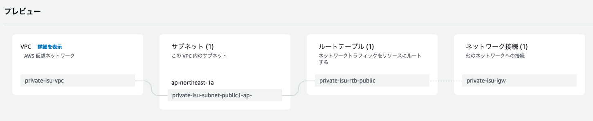
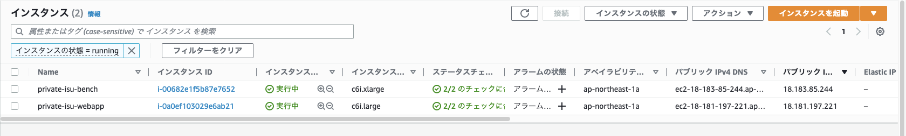

# AWS上にprivate-isuを作る手順


[https://github.com/catatsuy/private-isu](https://github.com/catatsuy/private-isu) を参考にawsにprivate-isu環境を作成したのでその手順のメモ。

## 構成

- 競技者用インスタンス: 1台
- ベンチマーカーインスタンス: 1台

## 作成手順

### VPCの作成

[Webコンソール](https://www.notion.so/m1-mac-m5stack-PlatformIO-4069ab4db6274f58b3cc2ff4e43c0cd5)から新規のVPCを作成する。

下記のように設定する。

- 作成するリソース: VPCなど
- 名前タグの自動生成: private-isu（ボックスにチェックを入れる）
- IPv4 CIDR ブロック: 10.0.0.0/16
- IPv6 CIDR ブロック: IPv6 CIDR ブロックなし
- テナンシー: デフォルト
- アベイラビリティゾーン（AZの数）: 1
- AZのカスタマイズ: （デフォルトのまま）
- パブリックサブネットの数:1
- プライベートサブネットの数:0
- サブネットCIDRブロックをカスタマイズ: （デフォルトのまま）
- NATゲートウェイ:なし
- VPCエンドポイント:なし
- DNSオプション
    - DNSホスト名を有効化: チェックを入れる
    - DNS解決を有効化: チェックを入れる



### キーペアの作成

競技者用インスタンスとベンチマーカーインスタンスにSSHするためのキーペアを作成。すでに作成済みを鍵を再利用する場合はこの手順はスキップする。

[Webコンソール](https://www.notion.so/private-isu-aws-75cddfaf0ba3419b9834831eb18b6eed)から作成する。今回は次のように入力したが、キーペアのタイプなどは何を選択しても問題ない（はず）。

- 名前: private-isu
- キーペアのタイプ: ED25519
- プライベートキーファイル形式: .pem

作成したキーペアの秘密鍵をダウンロードして、パーミッション設定などをしておく。

```
$ cd ~/Downloads/private-isu.pem ~/.ssh/
$ chmod 400 ~/.ssh/private-isu.pem
```

### 競技者用インスタンスの作成

競技者用インスタンスも[こちらのWebコンソール](https://www.notion.so/private-isu-aws-75cddfaf0ba3419b9834831eb18b6eed)から作成する。「インスタンスを起動」をクリックして次の内容を記入してインスタンスを起動させる。

- 名前とタグ:
  - 名前: private-isu-webapp
- アプリケーションおよび OS イメージ (Amazon マシンイメージ) 情報:
  - "ami-08bde596066780be7" を検索窓で検索して選択（AMIは [https://github.com/catatsuy/private-isu#ami](https://github.com/catatsuy/private-isu#ami) で公開されている最新版を選んでください）
- インスタンスタイプ: c6i.large
- キーペア: private-isu　（↑で作成したキーペア）
- ネットワーク設定:
  - VPC: private-isu-vpc
  - サブネット: private-isu-subnet-public1-ap-northeast-1a
  - パブリックIPの自動割り当て: 有効化
  - ファイアウォール（セキュリティグループ）: セキュリティグループを作成する
    - セキュリティグループ名: private-isu-webapp
    - 説明: allow ssh and http access
    - インバウンドセキュリティグループのルール
      - セキュリティグループルール1
        - タイプ: ssh
        - ソースタイプ: 任意の場所
      - セキュリティグループルール2
        - タイプ: HTTP
        - ソースタイプ: 任意の場所
- 他はデフォルト設定のまま

### ベンチマーカー用インスタンスの作成

ベンチマーカー用インスタンスも[こちらのWebコンソール](https://www.notion.so/private-isu-aws-75cddfaf0ba3419b9834831eb18b6eed)から作成していきます。「インスタンスを起動」をクリックして次の内容を記入してインスタンスを起動させます。

- 名前とタグ:
  - 名前: private-isu-bench
- アプリケーションおよび OS イメージ (Amazon マシンイメージ) 情報:
  - `ami-079828aa0027ea43f` を検索窓で検索して選択（AMIは [https://github.com/catatsuy/private-isu#ami](https://github.com/catatsuy/private-isu#ami) で公開されている最新版を選んでください）
- インスタンスタイプ: c6i.xlarge
- キーペア: private-isu　（↑で作成したキーペア）
- ネットワーク設定:
  - VPC:private-isu-vpc
  - サブネット:private-isu-subnet-public1-ap-northeast-1a
  - パブリックIPの自動割り当て:有効化
  - ファイアウォール（セキュリティグループ）:セキュリティグループを作成る
    - セキュリティグループ名: private-isu-bench
    - 説明: allow ssh access
    - インバウンドセキュリティグループのルール
      - セキュリティグループルール1
        - タイプ: ssh
        - ソースタイプ: 任意の場所
- 他はデフォルト設定のまま

### EC2インスタンスへの接続確認

作成したインスタンスのパブリックIPを[Webコンソール](https://www.notion.so/private-isu-aws-75cddfaf0ba3419b9834831eb18b6eed)で確認する。



IPがわかったら次のようにSSH接続できるか確認する。

```
$ ssh -i ~/.ssh/private-isu.pem ubuntu@<競技者用インスタンスIP>
$ ssh -i ~/.ssh/private-isu.pem ubuntu@<ベンチマーカー用インスタンスIP>
```

## 設定変更

初期設定ではRuby実装が起動しているのでGolangに切り替える。
まずは、競技者用インスタンスにSSHで接続する。

```
$ ssh -i ~/.ssh/private-isu.pem ubuntu@<競技者用インスタンスIP>
```

Ruby実装を停止してGolang実装を起動する。

```
$ sudo systemctl stop isu-ruby

$ sudo systemctl disable isu-ruby
Removed /etc/systemd/system/multi-user.target.wants/isu-ruby.service.

$ sudo systemctl start isu-go

$ sudo systemctl enable isu-go
Created symlink /etc/systemd/system/multi-user.target.wants/isu-go.service → /etc/systemd/system/isu-go.service.
```

正常に稼働しているか次のコマンドで確認する。

```bash
$ systemctl status isu-go
● isu-go.service - isu-go
     Loaded: loaded (/etc/systemd/system/isu-go.service; enabled; vendor preset: enabled)
     Active: active (running) since Sat 2023-02-18 17:05:25 JST; 32s ago
   Main PID: 2168 (app)
      Tasks: 6 (limit: 4596)
     Memory: 8.3M
        CPU: 7ms
     CGroup: /system.slice/isu-go.service
             └─2168 /home/isucon/private_isu/webapp/golang/app -bind 127.0.0.1:8080

Feb 18 17:05:25 ip-10-0-4-0 systemd[1]: Started isu-go.
```

## 動作確認

### ブラウザから動作確認

競技者用インスタンスにブラウザからアクセスする。 `http://<競技者用インスタンスIP>`

### ベンチマーカーの動作確認

ベンチマーカー用のインスタンスにSSH接続する。

```bash
ssh -i ~/.ssh/private-isu.pem ubuntu@<ベンチマーカー用インスタンスIP>
```

次のコマンドでベンチマークを実行する。

```bash
$ sudo su - isucon
$ /home/isucon/private_isu.git/benchmarker/bin/benchmarker -u /home/isucon/private_isu.git/benchmarker/userdata -t http://<競技者用インスタンスIP>
{"pass":true,"score":0,"success":295,"fail":61,"messages":["リクエストがタイムアウトしました (GET /)","リクエストがタイムアウトしました (GET /@alexandra)","リクエストがタイムアウトしました (GET /@chris)","リクエストがタイムアウトしました (GET /@chrystal)","リクエストがタイムアウトしました (GET /@katelyn)","リクエストがタイムアウトしました (GET /@maritza)","リクエストがタイムアウトしました (GET /@nadine)","リクエストがタイムアウトしました (GET /@wendy)","リクエストがタイムアウトしました (POST /login)","リクエス トがタイムアウトしました (POST /register)"]}
```

いくつかタイムアウトはでているがスコアはでているので成功。
